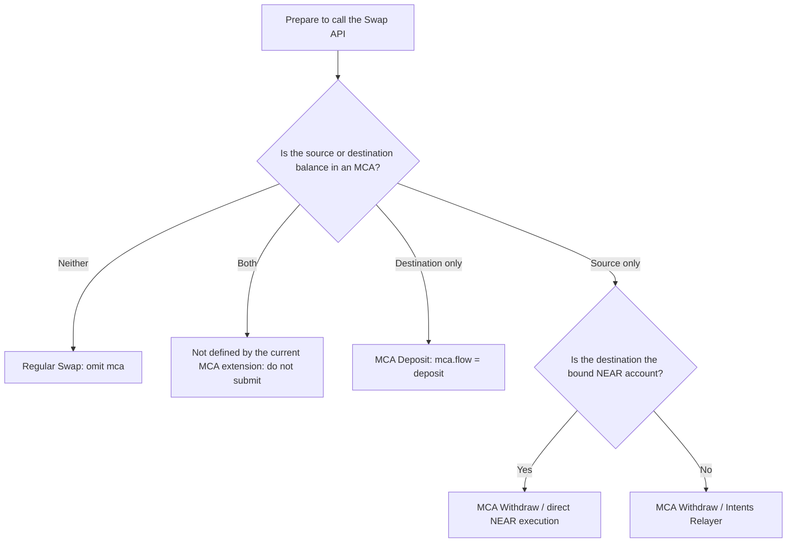
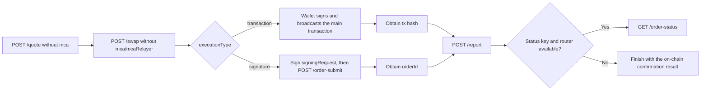
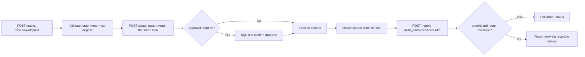
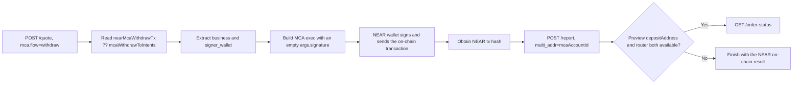
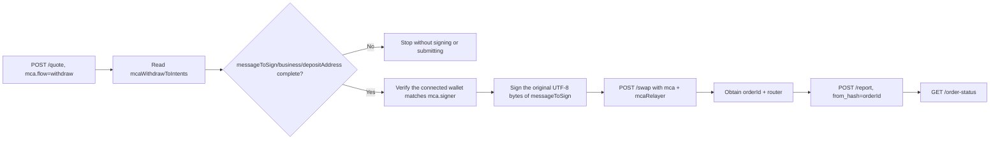
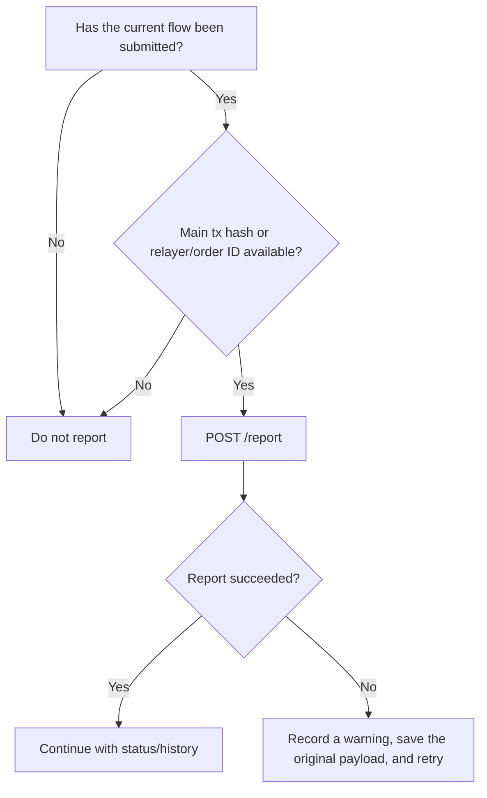

# RHEA CrossChainDex HTTP API Guide

This document describes the HTTP endpoints, request fields, response fields, and complete call sequences for MCA flows in the unified Swap service.

Scope:

- Depositing from a regular chain wallet into an MCA.
- Withdrawing from an MCA to its bound NEAR wallet.
- Withdrawing from an MCA to another chain through Intents / the multichain relayer.
- Transaction reporting, order status, and history.

This document does not cover MCA creation, wallet binding, lending, portfolio, or asset-query endpoints.

## Base URL and Authentication

The production API origin is fixed:

```text
https://api.rhea.finance
```

All Swap APIs use `https://api.rhea.finance/api/swap/*`. Examples represent the access token with the following variable:

```bash
ACCESS_TOKEN="<your-access-token>"
```

Request headers:

```http
Content-Type: application/json
Authorization: Bearer <ACCESS_TOKEN>
```

Never embed access tokens, wallet private keys, seed phrases, or fixed JWTs in frontend source code.

## Common Response Envelope

All endpoints return a unified JSON envelope:

```json
{
  "code": 0,
  "msg": "ok",
  "data": {}
}
```

Fields:

| Field | Type | Description |
| --- | --- | --- |
| `code` | number | `0` indicates business success; a non-zero value indicates a business error |
| `msg` | string | Error or informational message |
| `data` | object | Endpoint-specific response data |

Callers must check both the HTTP status and `code`:

```ts
async function swapApi<T>(path: string, init: RequestInit): Promise<T> {
  const response = await fetch(`https://api.rhea.finance${path}`, {
    ...init,
    headers: {
      "Content-Type": "application/json",
      Authorization: `Bearer ${ACCESS_TOKEN}`,
      ...init.headers,
    },
  });

  const body = await response.json();

  if (!response.ok) {
    throw new Error(body.msg || `HTTP ${response.status}`);
  }
  if (body.code !== 0) {
    throw new Error(body.msg || `API code ${body.code}`);
  }

  return body.data as T;
}
```

## First Decide Whether the Request Involves an MCA

`mca` is not a generally required field for `/quote` or `/swap`. The caller must determine the business flow from the actual source and destination of funds. Do not include `mca` merely because the user owns an MCA.

"Source is MCA" means the sold balance is deducted from the MCA account. "Destination is MCA" means the purchased asset is ultimately deposited into the MCA. In the HTTP API, `tokenIn` and `tokenOut` must always contain real on-chain token IDs, never the UI-only `mca:xxx` identifier.



Equivalent programmatic classification:

```ts
function classifySwap(input: {
  sourceIsMca: boolean;
  targetIsMca: boolean;
  toChain: string;
  recipient?: string;
  boundNearAccountId?: string;
}) {
  if (!input.sourceIsMca && !input.targetIsMca) return "normal";
  if (input.sourceIsMca && input.targetIsMca) return "unsupported";
  if (input.targetIsMca) return "mca-deposit";

  const withdrawsToBoundNear =
    input.toChain === "near" &&
    Boolean(input.recipient) &&
    input.recipient === input.boundNearAccountId;

  return withdrawsToBoundNear
    ? "mca-withdraw-near"
    : "mca-withdraw-relayer";
}
```

### Request Differences Between the Four Flows

| Flow | `mca` in `/quote` | `/swap` | `mcaRelayer` in `/swap` | MCA off-chain message signature | On-chain wallet signature | `/report` | `/order-status` |
| --- | --- | --- | --- | --- | --- | --- | --- |
| Regular Swap | Omit | Build a regular transaction | Omit | Not required | Required when executing `tx`; see the signed-order exception below | After the main transaction is submitted successfully | Only when both a status key and router exist |
| MCA Deposit | Required, `flow=deposit` | Build the source-chain transaction and pass through the same `mca` | Omit | Not required | Source-chain wallet signs `approve` and/or the main transaction | After obtaining the main transaction hash | When cross-chain and an orderId exists |
| MCA Withdraw to bound NEAR | Required, `flow=withdraw` | **Not called in the recommended direct flow** | Omit | Not required | NEAR wallet signs the `exec` transaction | After obtaining the NEAR transaction hash | When the preview has a deposit address and a router exists |
| MCA Withdraw to another chain | Required, `flow=withdraw` | Submit a relayer request | Required | **Required**; sign the exact API `messageToSign` | Usually no local-chain transaction is broadcast | After `/swap` returns an orderId | Use orderId + router |

### Do Not Confuse the Three Signature Types

- Regular transaction signature: the wallet signs the chain transaction returned by `/swap`; this does not produce `mcaRelayer.signature`.
- Regular Swap signed order: when `/swap` returns `executionType: "signature"` and `signingRequest`, sign that object and call `/api/swap/order-submit`. This is not an MCA signature.
- MCA relayer signature: used only in the `mcaWithdrawToIntents` branch. Put the result in `mcaRelayer.signature`; do not call `/api/swap/order-submit`.

## HTTP Endpoint Overview

| Method | Path | Purpose |
| --- | --- | --- |
| `POST` | `/api/swap/quote` | Get a regular or MCA quote; an MCA withdraw may include an execution preview |
| `POST` | `/api/swap/swap` | Build a regular/deposit transaction or submit an MCA withdraw relayer request |
| `POST` | `/api/swap/report` | Register history after obtaining a transaction hash or relayer orderId |
| `GET` | `/api/swap/order-status` | Query the status of a submitted order |
| `GET` | `/api/swap/history` | Query Swap history by sender/search value |

`POST /api/swap/order-submit` is only used for regular signed orders such as CoW. It is not required for MCA deposit or withdraw flows.

Supported chain families: EVM, Solana, Aptos, NEAR, Tron, Bitcoin, Zcash, and Sui. How to load the product token list and chain coverage is described in [Supported chains and tokens](#supported-chains-and-tokens).

## Supported chains and tokens

The product support list matches `multi-chain-lending` Trade: **18 mainnets**. Use the HTTP API chain ID for `fromChain` / `toChain` in Swap calls, and the token-query alias when fetching token metadata.

| Chain | Type | HTTP / SDK chain ID | Token query alias |
| --- | --- | --- | --- |
| Ethereum | EVM | `1` | `eth` |
| BNB Smart Chain | EVM | `56` | `bsc` |
| Arbitrum One | EVM | `42161` | `arb` |
| Base | EVM | `8453` | `base` |
| Optimism | EVM | `10` | `op` |
| Berachain | EVM | `1385` | `bera` |
| Monad | EVM | `143` | `monad` |
| X Layer | EVM | `196` | `xlayer` |
| Polygon PoS | EVM | `137` | `pol` |
| Gnosis Chain | EVM | `100` | `gnosis` |
| Plasma | EVM | `9745` | `plasma` |
| Solana | Non-EVM | `solana` | `sol` |
| Bitcoin | Non-EVM | `btc` | `btc` |
| NEAR | Non-EVM | `near` | `near` |
| Zcash | Non-EVM | `zcash` | `zcash` (also accepts `zec`) |
| Aptos | Non-EVM | `aptos` | `aptos` |
| Tron | Non-EVM | `tron` | `tron` |
| Sui | Non-EVM | `sui` | `sui` |

"Supported" means the product can load tokens for that chain and send them into the unified quote flow. It does **not** guarantee a route for every pair. Live liquidity, routers, amount, and service status still decide whether a quote succeeds.

### Token coverage (Unified Swap)

Across the 18 product chains above, Unified Swap currently covers **4,000+** tokens (same-chain DEX metadata plus cross-chain Intents tokens, deduplicated per direction). Snapshot: 2026-07-24. Counts change as liquidity providers and Intents listings update; always fetch the live token APIs below for the current list.

### How to fetch supported tokens

Token discovery uses HTTP endpoints **outside** `/api/swap/*`. The SDK does not wrap these calls; applications should `fetch` them directly and map results into `AssetRef` when calling `client.quote()`.

#### 1. Product token list (recommended for Trade UI)

```http
GET https://api.rhea.finance/get_multichain_lending_tokens_data?chains=<COMMA_SEPARATED_ALIASES>
```

Query all currently supported product chains:

```bash
curl "https://api.rhea.finance/get_multichain_lending_tokens_data?chains=bsc,eth,arb,base,op,bera,monad,xlayer,pol,gnosis,plasma,sol,btc,near,zcash,zec,aptos,tron,sui"
```

A successful response is a **JSON array** of token objects (not the `/api/swap` `{ code, data, msg }` envelope). Typical fields:

| Field | Description |
| --- | --- |
| `assetId` | Multichain / Intents asset ID |
| `blockchain` | Token query alias (`eth`, `near`, …) |
| `symbol` | Display symbol |
| `decimals` | Token decimals |
| `contractAddress` | On-chain address; may be empty for natives |
| `price` / `priceUpdatedAt` | Display price only; not a swap quote |
| `icon` | Optional icon URL |

Integration tips:

- Group by `blockchain`; do not merge tokens by `symbol` alone.
- For `quote()`, pass the chain-specific token address/ID as `AssetRef.address`, and use the HTTP/SDK chain ID in `fromChain` / `toChain` / `AssetRef.chain` (for example Base `"8453"`, Solana `"solana"`).
- Presence in this list means the token is discoverable. Confirm a route with `client.quote()` (or `POST /api/swap/quote`) before trading.
- Prefer short-lived cache; refresh periodically instead of hard-coding the list.

#### 2. Per-chain token price metadata

```http
GET https://api.rhea.finance/get_chain_prices?chain=<TOKEN_QUERY_ALIAS>
```

Example:

```bash
curl "https://api.rhea.finance/get_chain_prices?chain=eth"
curl "https://api.rhea.finance/get_chain_prices?chain=bsc"
curl "https://api.rhea.finance/get_chain_prices?chain=base"
```

`chain` is required and must be a **token query alias** (`eth`, `bsc`, `base`, …). A successful response uses `{ code, data, msg }`:

```ts
// code === 0 && msg === "success"
type ChainPricesResponse = {
  code: number;
  msg: string;
  data: Record<
    string,
    {
      address: string;
      chainId: number;
      decimals: number;
      symbol: string;
      name?: string;
      price: string;
      logoURI?: string;
      updated_at?: number;
    }
  >;
};
```

Use this endpoint for same-chain token metadata and display prices. It is keyed by token address. It does not replace `get_multichain_lending_tokens_data` for the full multi-chain Trade selector, and some non-EVM aliases may return an empty `data` object.

### Native Asset Token IDs

Common token IDs for native assets:

| Chain | Native asset token ID |
| --- | --- |
| EVM | `0x0000000000000000000000000000000000000000` |
| Solana | `So11111111111111111111111111111111111111112` |
| Aptos | `0xa` |
| NEAR | `wrap.near` |
| Tron | `trx` |
| Bitcoin | `btc` |
| Zcash | `nep141:zec.omft.near` |
| Sui | `0x2::sui::SUI` |

For an MCA-side token, use the token ID accepted by the Swap API/Burrow, such as `usdc.token.near`. Do not send the UI-only `mca:...` identifier.

Whenever one side is an MCA, the API chain ID for that side is always `near`, and the token ID is the NEAR contract account ID after removing the `mca:`, `nep141:`, or `nep245:` prefix.

Swap amounts such as `amountIn`, `amountOut`, `minAmountOut`, and `expectedOut` use integer strings in token base units. `decreaseCollateralAmountBurrow` is the exception: it uses the decimal balance string returned by the Burrow portfolio, may contain a decimal point, and must not be converted again using token decimals.

Address semantics in MCA flows:

| Flow | `sender` | `recipient` |
| --- | --- | --- |
| Deposit | Paying wallet on the source chain | MCA account ID |
| Withdraw to bound NEAR | MCA account ID | Bound NEAR account ID |
| Withdraw Relayer | MCA account ID | Final external-chain or unbound NEAR recipient address |

## When and How to Send the `mca` Field

Include `mca` in `POST /api/swap/quote` only when `classifySwap` returns `mca-deposit`, `mca-withdraw-near`, or `mca-withdraw-relayer`.

- Regular Swap: omit the entire `mca` field; do not send `{}` or `null`.
- MCA Deposit: use the same `mca` object for the quote and subsequent `/swap` call.
- MCA Withdraw to bound NEAR: include it only in the quote; execute the preview directly afterward without calling `/swap` in the recommended flow.
- MCA Withdraw through the relayer: include it in the quote, pass it through to `/swap`, and add `mcaRelayer`.

Deposit example:

```json
{
  "flow": "deposit",
  "mcaAccountId": "account.near",
  "signer": {
    "chain": "evm",
    "identityKey": "0xSignerAddress"
  },
  "useAsCollateral": true
}
```

Withdraw example:

```json
{
  "flow": "withdraw",
  "mcaAccountId": "account.near",
  "signer": {
    "chain": "evm",
    "identityKey": "0xSignerAddress"
  },
  "needDecreaseCollateral": true,
  "decreaseCollateralAmountBurrow": "12.5",
  "withdrawAll": false
}
```

Field requirements:

| Field | Type | Required | Description |
| --- | --- | --- | --- |
| `flow` | `deposit \| withdraw` | Yes for MCA | Direction of MCA funds; the entire `mca` object is absent for a regular Swap |
| `mcaFlow` | `deposit \| withdraw` | No | Compatibility alias for `flow` |
| `mcaAccountId` | string | Yes for MCA | MCA NEAR account ID |
| `mca_id` | string | No | Compatibility alias for `mcaAccountId` |
| `signer.chain` | string | Yes for MCA | Chain type of the bound wallet controlling the MCA for this request |
| `signer.identityKey` | string | Yes for MCA | Bound-wallet identity; the relayer signing wallet must match it |
| `depositSigner` | object | No | Compatibility field for the deposit signer |
| `useAsCollateral` | boolean | Yes for deposit | Whether to use the deposited asset as collateral; explicitly send `true` or `false` |
| `needDecreaseCollateral` | boolean | Yes for withdraw | `true` when the current token's Burrow collateral balance is greater than zero |
| `decreaseCollateralAmountBurrow` | string | Yes for withdraw | When `true`, send the current token's full collateral balance; when `false`, send `"0"`. This is not `amountIn` |
| `withdrawAll` | boolean | No | Send `true` for Max or when the requested amount reaches `99.9999%` of the available balance; omit or send `false` for a partial withdrawal |
| `recipientMsgSignatures` | string[] | Conditional | Pass through an existing recipient proof only; this is not the `messageToSign` signature and is omitted by default |
| `depositSignerProofSignatures` | string[] | Conditional | Pass through an existing deposit-signer proof only; omitted by default |
| `amountBurrow` | string | No | Compatibility amount field |
| `amount_with_inner_decimal` | string | No | Compatibility amount field |
| `amount_burrow` | string | No | Compatibility amount field |

New integrations should prefer `flow`, `mcaAccountId`, and `signer`. `mcaFlow`, `mca_id`, `depositSigner`, and the three amount aliases exist only for backward compatibility. Do not send both the new and legacy fields together.

`recipientMsgSignatures`, `depositSignerProofSignatures`, and the relayer's `messageToSign` are three different kinds of data. The current Swap flow does not generate the first two arrays. Pass them through only when the caller already obtained the corresponding proofs from a trusted flow; never populate them with the current relayer signature.

Resolve the withdraw collateral policy before requesting a quote:

```ts
const needDecreaseCollateral = decimalGt(collateralBalance, "0");
const decreaseCollateralAmountBurrow = needDecreaseCollateral
  ? collateralBalance
  : "0";
const withdrawAll =
  isMax || decimalGte(amountInHuman, decimalMul(availableBalance, "0.999999"));
```

`amountInHuman` is used only to determine whether the withdrawal is close to the full available balance. The `amountIn` sent to the Swap API remains an integer in base units.

## Quote API Reference: POST `/api/swap/quote`

Retrieves the quote, router, build pass-through fields, and MCA execution preview.

### Request

```http
POST /api/swap/quote
Content-Type: application/json
Authorization: Bearer <ACCESS_TOKEN>
```

Base request body for a regular swap (note that it does not include `mca`):

```json
{
  "fromChain": "1",
  "toChain": "near",
  "tokenIn": "0xA0b86991c6218b36c1d19d4a2e9eb0ce3606eb48",
  "tokenOut": "usdc.token.near",
  "amountIn": "1000000",
  "slippage": 50,
  "quoteWaitingTimeMs": 3000,
  "sender": "0xSenderAddress",
  "recipient": "account.near"
}
```

Base fields:

| Field | Type | Required | Description |
| --- | --- | --- | --- |
| `fromChain` | string | Yes | Source-chain API chain ID |
| `toChain` | string | Yes | Destination-chain API chain ID |
| `tokenIn` | string | Yes | Source token ID/address |
| `tokenOut` | string | Yes | Destination token ID/address |
| `amountIn` | string | Yes | Integer string in the token's smallest unit |
| `quoteWaitingTimeMs` | number | No | **Frontend-configurable Near Intents quote wait time (ms).** See [quoteWaitingTimeMs](#quotewaitingtimems-near-intents) below. |
| `slippage` | number | No | Basis points; `50` means 0.5% |
| `sender` | string | Yes | Source wallet or MCA account |
| `recipient` | string | No | Final recipient address |
| `mca` | object | Conditional | Include only for a one-sided MCA deposit/withdraw; omit for a regular swap |

#### `quoteWaitingTimeMs` (Near Intents)

> **Important:** `quoteWaitingTimeMs` is a **first-class quote request parameter that the frontend / client may set on every `POST /api/swap/quote` call**. It controls how long the quote service may wait for **Near Intents** (and similar intent-based routers) to return a quote. It is **not** an on-chain RPC timeout, wallet signing timeout, or bridge settlement timer.

| Rule | Detail |
| --- | --- |
| Who sets it | Frontend / SDK / any HTTP client — pass it in the JSON body of `/api/swap/quote` |
| Unit | Milliseconds (`number`, non-negative integer) |
| Default when omitted | Backend / SDK commonly use `3000` (3 seconds). Prefer sending it explicitly from the frontend when Near Intents latency matters. |
| Typical use | Raise the value (e.g. `5000`–`10000`) if Near Intents quotes often time out; lower it (e.g. `0`–`1000`) for snappier UX when a fast miss is acceptable |
| Scope | Applies to the quote aggregation wait for intent routes such as `nearintents` / `preswap-nearintents`, **including MCA flows** that build deposit/withdraw previews through Near Intents (e.g. `near-mca-deposit`, `near-mca-withdraw`). MCA preview fields (`nearDepositTx`, `nearMcaWithdrawTx`, `mcaWithdrawToIntents`, etc.) are produced in the same quote request and **are also subject to this timer**. |

Example — frontend passes a longer wait for Near Intents:

```json
{
  "fromChain": "8453",
  "toChain": "solana",
  "tokenIn": "0x833589fCD6eDb6E08f4c7C32D4f71b54bdA02913",
  "tokenOut": "EPjFWdd5AufqSSqeM2qN1xzybapC8G4wEGGkZwyTDt1v",
  "amountIn": "1000000",
  "slippage": 50,
  "quoteWaitingTimeMs": 5000,
  "sender": "0xSenderAddress",
  "recipient": "SolanaRecipientAddress"
}
```

```ts
// Frontend: always pass quoteWaitingTimeMs when calling the quote API.
await swapApi("/api/swap/quote", {
  method: "POST",
  body: JSON.stringify({
    fromChain: "8453",
    toChain: "solana",
    tokenIn: "0x833589fCD6eDb6E08f4c7C32D4f71b54bdA02913",
    tokenOut: "EPjFWdd5AufqSSqeM2qN1xzybapC8G4wEGGkZwyTDt1v",
    amountIn: "1000000",
    slippage: 50,
    quoteWaitingTimeMs: 5000, // Near Intents quote wait — frontend controlled
    sender: "0xSenderAddress",
    recipient: "SolanaRecipientAddress",
  }),
});
```

### Response

The following is an MCA deposit quote response example. A regular swap does not require these MCA preview fields:

```json
{
  "code": 0,
  "msg": "ok",
  "data": {
    "isCrossChain": true,
    "chainType": "cross-chain",
    "bestQuote": {
      "router": "near-mca-deposit",
      "amountOut": "995000",
      "minAmountOut": "990025",
      "market": "example-market",
      "preSwap": null,
      "bridge": null,
      "quoteId": "optional-quote-id"
    },
    "allQuotes": [],
    "nearDepositTx": {},
    "nearDepositTxError": null
  }
}
```

Common response fields:

| Field | Type | Description |
| --- | --- | --- |
| `isCrossChain` | boolean | Whether the route is cross-chain |
| `chainType` | string | Source-chain transaction type, or `cross-chain` |
| `bestQuote` | object | Best quote; selected fields must be passed through to `/swap` |
| `allQuotes` | object[] | Other quote candidates |
| `errors` | unknown | Routing aggregation errors |
| `nearDepositTx` | object | MCA deposit preview |
| `nearDepositTxError` | string | Deposit preview error |
| `nearMcaWithdrawTx` | object | MCA `exec` preview for a withdrawal to NEAR |
| `nearMcaWithdrawTxError` | string | Withdrawal preview error |
| `mcaWithdrawToIntents` | object | Relayer preview for a withdrawal to Intents/another chain |
| `mcaContext` | object | Optional MCA context |

Required application checks:

- `bestQuote.router` is not empty.
- For `near-mca-deposit`, `nearDepositTxError` is empty.
- For `near-mca-withdraw`, `nearMcaWithdrawTxError` is empty.

## Flow: Regular Swap (No MCA)

When neither the source nor the destination is an MCA balance, omit `mca` from both the quote and build bodies, and omit `multi_addr` from the report.



Use the regular request body shown above for the quote. Pass the `bestQuote` fields through to the build request, but do not add an empty `mca` object:

```json
{
  "fromChain": "1",
  "toChain": "near",
  "tokenIn": "0xA0b86991c6218b36c1d19d4a2e9eb0ce3606eb48",
  "tokenOut": "usdc.token.near",
  "amountIn": "1000000",
  "slippage": 50,
  "sender": "0xSenderAddress",
  "recipient": "alice.near",
  "router": "nearintents",
  "expectedOut": "995000",
  "minAmountOut": "990025",
  "preSwap": null,
  "bridge": {
    "route": "intents"
  }
}
```

Execution rules:

- If `executionType` is absent or equals `transaction`, execute `approve` if present according to `chainType`, then execute the main `tx`. The approval hash is not the swap's `from_hash`; do not report after the approval alone.
- If `executionType` is `signature`, sign `signingRequest`, call `/api/swap/order-submit`, and report after obtaining the order ID. This is unrelated to the MCA `messageToSign`.
- If the wallet rejects the signature, the user cancels, the main transaction fails to broadcast, or `/order-submit` fails, there is no transaction hash/order ID, so do not report.

## Flow: MCA Deposit

When the destination asset enters the MCA, include the same `mca` object in both the quote and build requests. This branch has no `messageToSign`. The bound wallet only identifies the MCA controller; the actual signatures apply to the source-chain `approve` and main transaction.



### Deposit Quote Request

```bash
curl -X POST "https://api.rhea.finance/api/swap/quote" \
  -H "Authorization: Bearer $ACCESS_TOKEN" \
  -H "Content-Type: application/json" \
  -d '{
    "fromChain": "1",
    "toChain": "near",
    "tokenIn": "0xA0b86991c6218b36c1d19d4a2e9eb0ce3606eb48",
    "tokenOut": "usdc.token.near",
    "amountIn": "1000000",
    "slippage": 50,
    "sender": "0xSenderAddress",
    "recipient": "account.near",
    "mca": {
      "flow": "deposit",
      "mcaAccountId": "account.near",
      "signer": {
        "chain": "evm",
        "identityKey": "0xSenderAddress"
      },
      "useAsCollateral": true
    }
  }'
```

Expected router:

```text
near-mca-deposit
```

### Deposit Build Request

After the quote succeeds, construct the build body:

```json
{
  "fromChain": "1",
  "toChain": "near",
  "tokenIn": "0xA0b86991c6218b36c1d19d4a2e9eb0ce3606eb48",
  "tokenOut": "usdc.token.near",
  "amountIn": "1000000",
  "slippage": 50,
  "sender": "0xSenderAddress",
  "recipient": "account.near",
  "mca": {
    "flow": "deposit",
    "mcaAccountId": "account.near",
    "signer": {
      "chain": "evm",
      "identityKey": "0xSenderAddress"
    },
    "useAsCollateral": true
  },
  "router": "near-mca-deposit",
  "market": "example-market",
  "expectedOut": "995000",
  "minAmountOut": "990025",
  "preSwap": null,
  "bridge": null,
  "quoteId": "optional-quote-id"
}
```

Field sources:

| Build Field | Source |
| --- | --- |
| Common quote request fields | Original quote request |
| `router` | `bestQuote.router` |
| `market` | `bestQuote.market`, when present |
| `expectedOut` | `bestQuote.amountOut` or `bestQuote.estimatedOut` |
| `minAmountOut` | `bestQuote.minAmountOut`; use `expectedOut` when absent |
| `preSwap` | Always `null` for `near-mca-deposit` / `near-mca-withdraw`; only regular routers pass through `bestQuote.preSwap ?? null` |
| `bridge` | Always `null` for `near-mca-deposit` / `near-mca-withdraw`; only regular routers pass through `bestQuote.bridge ?? null` |
| `quoteId` | `bestQuote.quoteId`, when present |

Request:

```bash
curl -X POST "https://api.rhea.finance/api/swap/swap" \
  -H "Authorization: Bearer $ACCESS_TOKEN" \
  -H "Content-Type: application/json" \
  -d @deposit-build.json
```

### Deposit Build Response

```json
{
  "code": 0,
  "msg": "ok",
  "data": {
    "isCrossChain": true,
    "chainType": "evm",
    "router": "near-mca-deposit",
    "fromChain": "1",
    "toChain": "near",
    "tokenIn": {
      "address": "0xA0b86991c6218b36c1d19d4a2e9eb0ce3606eb48",
      "symbol": "USDC",
      "decimals": 6
    },
    "tokenOut": {
      "address": "usdc.token.near",
      "symbol": "USDC",
      "decimals": 6
    },
    "amountIn": "1000000",
    "estimatedOut": "995000",
    "minAmountOut": "990025",
    "needsApprove": true,
    "approve": {
      "spender": "0xSpender",
      "tx": {
        "to": "0xToken",
        "data": "0x...",
        "value": "0",
        "gasLimit": "60000",
        "chainId": 1
      }
    },
    "tx": {
      "to": "0xRouter",
      "data": "0x...",
      "value": "0",
      "gasLimit": "250000",
      "chainId": 1
    },
    "deposit": {
      "depositAddress": "optional-deposit-address",
      "orderId": "optional-order-id"
    }
  }
}
```

The caller must execute `approve` and `tx` according to `chainType`. See “Chain Transaction Formats in Build Responses” below for the `tx` format of each source chain.

## Flow: MCA Withdrawal to the Bound NEAR Wallet

Use direct NEAR execution only when all of the following conditions are met:

- The source balance belongs to the MCA.
- `toChain` is `near`.
- `recipient` equals the NEAR account ID bound to the MCA.
- `nearMcaWithdrawTx ?? mcaWithdrawToIntents` from the quote is usable as a NEAR exec preview, and `nearMcaWithdrawTxError` is empty.

The branch is determined by whether the destination is the bound NEAR account, not by `submissionMode` in the preview. If an application internally uses chain IDs such as `near:mainnet`, it must still normalize them to `near` before calling the HTTP API.



This path **does not call** `POST /api/swap/swap` and does not sign `messageToSign`. The `signature` in the `exec` arguments is an empty string; the NEAR wallet signs the on-chain transaction itself.

### Withdraw-to-NEAR Quote Request

```bash
curl -X POST "https://api.rhea.finance/api/swap/quote" \
  -H "Authorization: Bearer $ACCESS_TOKEN" \
  -H "Content-Type: application/json" \
  -d '{
    "fromChain": "near",
    "toChain": "near",
    "tokenIn": "usdc.token.near",
    "tokenOut": "usdc.token.near",
    "amountIn": "1000000",
    "slippage": 50,
    "sender": "account.near",
    "recipient": "alice.near",
    "mca": {
      "flow": "withdraw",
      "mcaAccountId": "account.near",
      "signer": {
        "chain": "near",
        "identityKey": "alice.near"
      },
      "needDecreaseCollateral": false,
      "decreaseCollateralAmountBurrow": "0",
      "withdrawAll": false
    }
  }'
```

Expected router:

```text
near-mca-withdraw
```

### Withdraw-to-NEAR Preview

Selection priority for the direct NEAR execution preview:

1. `data.nearMcaWithdrawTx`
2. `data.mcaWithdrawToIntents`, as a fallback only when the first field is absent and the destination is the bound NEAR account

The selected preview may use either of the following structures.

Structure 1: transaction list:

```json
{
  "nearMcaWithdrawTx": {
    "mcaAccountId": "account.near",
    "depositAddress": "status-deposit-address",
    "transactions": [
      {
        "contractId": "account.near",
        "methodName": "exec",
        "args": {
          "business": {
            "action": "withdraw"
          },
          "signer_wallet": {
            "Near": "alice.near"
          }
        },
        "gas": 300,
        "deposit": "0"
      }
    ]
  }
}
```

Structure 2: NEAR FunctionCall actions:

```json
{
  "nearMcaWithdrawTx": {
    "receiverId": "account.near",
    "actions": [
      {
        "type": "FunctionCall",
        "params": {
          "args": "{\"business\":{\"action\":\"withdraw\"},\"signer_wallet\":{\"Near\":\"alice.near\"}}"
        }
      }
    ]
  }
}
```

The caller must support resolving `business` from the following locations in the selected preview:

1. `preview.business`
2. `preview.transactions[0].args.business`
3. `preview.actions[].params.args.business`

`actions[].params.args` may be either an object or a JSON string. Use the same priority and parsing rules for `signer_wallet`. Stop execution if `business` cannot be resolved. Fall back to `{ "Near": recipient }` only when `signer_wallet` cannot be resolved.

The two structures are executed differently:

- When a valid `transactions[]` array is present, map each entry to a NEAR FunctionCall. Preserve each entry's existing `args`, then overwrite the fields with the resolved `business`, `signer_wallet`, and an empty `signature`.
- When only `actions[]` is present, use the actions to extract business parameters rather than replaying them directly. The client constructs an `exec` call to `mcaAccountId` with 300 TGas and a zero deposit.

### NEAR Contract Call

Call `exec` on the MCA account:

```json
{
  "receiverId": "account.near",
  "actions": [
    {
      "type": "FunctionCall",
      "params": {
        "methodName": "exec",
        "args": {
          "business": {
            "action": "withdraw"
          },
          "signer_wallet": {
            "Near": "alice.near"
          },
          "signature": ""
        },
        "gas": "300000000000000",
        "deposit": "0"
      }
    }
  ]
}
```

Rules:

- Use `mcaAccountId` when `contractId`/`receiverId` is absent.
- Use `exec` when `methodName` is absent.
- Preview value `gas: 300` means 300 TGas and must be converted to `300000000000000`.
- Preview `deposit` is denominated in NEAR and must be converted to yoctoNEAR.
- Prefer `signer_wallet` from the quote; when absent, `{ "Near": recipient }` may be used.
- This path uses an empty string for `signature`; the NEAR wallet signs the on-chain transaction itself.
- Resolve the status deposit address from `depositAddress` / `deposit_address` / `deposit.depositAddress` / `deposit.deposit_address` in the selected preview. When using the HTTP API directly, the on-chain transaction can still be broadcast if this address is absent, but `/order-status` cannot be called. When the SDK uses `waitFor: "completed"`, it validates this address before broadcasting and returns an error if it is missing. Use `waitFor: "source-confirmed"` to wait only for the NEAR on-chain result.

## Flow: MCA Withdrawal via the Intents Relayer

Use the relayer when the source is an MCA but the destination is not the bound NEAR account. The destination may be an external-chain address such as EVM, Solana, Aptos, Sui, or BTC, or an unbound NEAR address. Even if the preview includes `submissionMode`, the address-binding relationship remains the final branch criterion.



In this branch, `/swap` submits to the relayer; it does not return a source-chain transaction for the caller to broadcast again. Call `/swap` only after signing succeeds. Stop immediately if the signature is rejected or empty.

### Relayer Quote Request

```bash
curl -X POST "https://api.rhea.finance/api/swap/quote" \
  -H "Authorization: Bearer $ACCESS_TOKEN" \
  -H "Content-Type: application/json" \
  -d '{
    "fromChain": "near",
    "toChain": "1",
    "tokenIn": "usdc.token.near",
    "tokenOut": "0xA0b86991c6218b36c1d19d4a2e9eb0ce3606eb48",
    "amountIn": "1000000",
    "slippage": 50,
    "sender": "account.near",
    "recipient": "0xRecipientAddress",
    "mca": {
      "flow": "withdraw",
      "mcaAccountId": "account.near",
      "signer": {
        "chain": "evm",
        "identityKey": "0xSignerAddress"
      },
      "needDecreaseCollateral": true,
      "decreaseCollateralAmountBurrow": "12.5",
      "withdrawAll": true
    }
  }'
```

### Relayer Preview Response

```json
{
  "code": 0,
  "msg": "ok",
  "data": {
    "isCrossChain": true,
    "chainType": "cross-chain",
    "bestQuote": {
      "router": "near-mca-withdraw",
      "amountOut": "995000",
      "minAmountOut": "990025",
      "preSwap": null,
      "bridge": null
    },
    "allQuotes": [],
    "mcaWithdrawToIntents": {
      "submissionMode": "multichain_relayer",
      "mcaAccountId": "account.near",
      "messageToSign": "exact message returned by API",
      "business": {
        "action": "withdraw"
      },
      "depositAddress": "intents-deposit-address"
    }
  }
}
```

Required validation:

- `mcaWithdrawToIntents` is an object.
- `messageToSign` is a non-empty string.
- `business` is an object.
- A non-empty deposit address can be resolved using the priority below.
- The current signing wallet matches `mca.signer` in the quote request.

Signing rule:

```ts
const signature = await wallet.signMessage(
  quote.data.mcaWithdrawToIntents.messageToSign
);
```

`messageToSign` is an opaque string. The caller must sign its **original UTF-8 bytes**:

- Do not call `trim()`.
- Do not parse and reserialize it.
- Do not replace it with `JSON.stringify(business)`.
- Do not append a nonce, deadline, recipient, or any other business field yourself.
- Use the domain/prefix defined by the wallet standard itself, such as the EIP-191 prefix applied by EVM `signMessage`; do not manually add it before calling the wallet.

The client must not reconstruct `business`. When submitting `/swap`, place the original `business` object returned by the quote preview in `mcaRelayer.business` unchanged.

Deposit address resolution priority:

1. Top-level `data.depositAddress` in the quote response.
2. `mcaWithdrawToIntents.depositAddress` or `deposit_address`.
3. `mcaWithdrawToIntents.deposit.depositAddress` or `deposit.deposit_address`.
4. The corresponding direct/nested fields in `bestQuote`.

If none exists, do not sign or submit the relayer `/swap` request. The reference application also reads a cached deposit address from the quote snapshot/store; a pure HTTP client must not depend on a UI store.

### Relayer Wallet Descriptor

`mcaRelayer.wallet` format:

| Signer Chain | `wallet` JSON |
| --- | --- |
| EVM | `{ "EVM": "<address-without-0x>" }` |
| Solana | `{ "Solana": "<public-key>" }` |
| Bitcoin | `{ "Bitcoin": "<signing-public-key>" }` |
| NEAR | `{ "Near": "<account-id>" }` |
| Aptos | `{ "Aptos": "<identity-key>" }` |
| Sui | `{ "Sui": "<identity-key>" }` |
| Zcash | `{ "Zcash": "<signing-public-key>" }` |
| Tron | `{ "Tron": "<identity-key>" }` |

The raw API type permits `wallet` to be either an object or a compact JSON string. The reference flow sends an object, and new integrations should also prefer an object to avoid double JSON encoding. The wallet descriptor must represent the same wallet as the quote's `mca.signer`. When comparing EVM identities, ignore the `0x` prefix and letter case. For Aptos/Sui identities, ignore letter case. Compare other chains using the original string.

### `mcaRelayer.signature` Format

The HTTP field type is always a string, but its internal encoding depends on the `wallet` variant. The current `multi-chain-lending` reference implementation uses the following encoding rules:

| Wallet Variant | Signing Input and Algorithm | `mcaRelayer.signature` Content |
| --- | --- | --- |
| `EVM` | `signer.signMessage(messageToSign)`, an EIP-191 personal message | Hex-encoded 65-byte signature, **without `0x`** |
| `Solana` | Wallet `signMessage(UTF8(messageToSign))` | Lowercase hex-encoded 64-byte signature |
| `Bitcoin` | Wallet-standard `signMessage(messageToSign)` | Decode the wallet's base64 signature and encode it as hex |
| `Near` | NEP-413/Wallet Selector `signMessage`; message is UTF-8 bytes, recipient is the signing account, and nonce must be unique | Pass through a string response unchanged; encode a byte response as hex |
| `Aptos` | `signMessage({ message, address:false, application:false, chainId:false, nonce:"0" })` | Signature hex without `0x` |
| `Sui` | `signPersonalMessage({ message: UTF8(messageToSign) })` | Normalized raw signature in lowercase hex; the reference implementation removes the scheme/public-key wrapper from the serialized signature |

EVM example:

```ts
const signed = await signer.signMessage(messageToSign);
const signature = signed.replace(/^0x/i, "");
```

Solana example:

```ts
const bytes = new TextEncoder().encode(messageToSign);
const signed = await wallet.signMessage(bytes);
const signature = Buffer.from(signed).toString("hex");
```

Bitcoin example:

```ts
const signed = await wallet.signMessage(messageToSign);
const signature = Buffer.from(signed.signature, "base64").toString("hex");
```

Chain support distinguishes between two capabilities:

- `{ "Zcash": ... }` and `{ "Tron": ... }` are valid MCA wallet descriptors and can represent a bound identity.
- The current `multi-chain-lending` swap relayer flow explicitly disallows Zcash/Tron as the offline-message signer for this operation; Tron also has no corresponding `sign_message` implementation. They can still act as deposit/destination-chain transaction executors. HTTP callers may use them to generate `mcaRelayer.signature` only after both server-side signature verification and the wallet adapter explicitly support it.

For every chain, the final signature must be a non-empty string. Do not call `/swap` if the wallet rejects the signature, returns an empty value, or encoding fails.

### Relayer `/swap` Request

`mcaRelayer` appears only in the `/swap` body for this branch. It does not appear in quote, direct NEAR execution, or deposit requests:

| Field | Required | Source |
| --- | --- | --- |
| `mcaRelayer.mcaAccountId` | Yes | Exactly matches quote `mca.mcaAccountId` |
| `mcaRelayer.wallet` | Yes | Single-key descriptor generated for the actual signing chain, matching quote `mca.signer` |
| `mcaRelayer.business` | Yes | Pass through quote `mcaWithdrawToIntents.business` unchanged |
| `mcaRelayer.signature` | Yes | Non-empty signature string over the original quote `messageToSign` |
| `deposit_address` | Yes | Intents deposit address returned by the preview or `bestQuote` |
| `is_cross_chain` | Yes | Use quote `isCrossChain`; default to `true` for this branch when absent |
| `tx_type` | Yes | Always `mca-withdraw-relayer` |
| `multi_addr` | Yes | MCA account ID used to associate report/history records |

The build body must retain the `mca` object used for the quote; do not send only `mcaRelayer`.

```json
{
  "fromChain": "near",
  "toChain": "1",
  "tokenIn": "usdc.token.near",
  "tokenOut": "0xA0b86991c6218b36c1d19d4a2e9eb0ce3606eb48",
  "amountIn": "1000000",
  "slippage": 50,
  "sender": "account.near",
  "recipient": "0xRecipientAddress",
  "router": "near-mca-withdraw",
  "expectedOut": "995000",
  "minAmountOut": "990025",
  "preSwap": null,
  "bridge": null,
  "mca": {
    "flow": "withdraw",
    "mcaAccountId": "account.near",
    "signer": {
      "chain": "evm",
      "identityKey": "0xSignerAddress"
    },
    "needDecreaseCollateral": true,
    "decreaseCollateralAmountBurrow": "12.5",
    "withdrawAll": true
  },
  "mcaRelayer": {
    "mcaAccountId": "account.near",
    "wallet": {
      "EVM": "SignerAddress"
    },
    "business": {
      "action": "withdraw"
    },
    "signature": "wallet-signature"
  },
  "deposit_address": "intents-deposit-address",
  "is_cross_chain": true,
  "tx_type": "mca-withdraw-relayer",
  "multi_addr": "account.near"
}
```

curl:

```bash
curl -X POST "https://api.rhea.finance/api/swap/swap" \
  -H "Authorization: Bearer $ACCESS_TOKEN" \
  -H "Content-Type: application/json" \
  -d @mca-withdraw-relayer.json
```

### Relayer Response

```json
{
  "code": 0,
  "msg": "ok",
  "data": {
    "isCrossChain": true,
    "chainType": "near",
    "router": "near-mca-withdraw",
    "statusRouter": "near-mca-withdraw",
    "fromChain": "near",
    "toChain": "1",
    "tokenIn": {
      "address": "usdc.token.near",
      "symbol": "USDC",
      "decimals": 6
    },
    "tokenOut": {
      "address": "0xA0b86991c6218b36c1d19d4a2e9eb0ce3606eb48",
      "symbol": "USDC",
      "decimals": 6
    },
    "amountIn": "1000000",
    "estimatedOut": "995000",
    "minAmountOut": "990025",
    "tx": null,
    "approve": null,
    "orderId": "relayer-order-id",
    "deposit": {
      "depositAddress": "intents-deposit-address",
      "orderId": "relayer-order-id"
    }
  }
}
```

Order ID resolution priority:

1. `data.orderId`
2. `data.deposit.orderId`

Router resolution priority:

1. `data.router`
2. `data.statusRouter`
3. Quote `bestQuote.router`

The relayer response does not require the caller to broadcast `tx`. After a successful submission, report immediately and poll order status.

## When to Call Report

The trigger for `POST /api/swap/report` is not “`/swap` was called,” but that **a trackable main transaction identifier has been produced**.



### Report Is Required

| Scenario | When to Report | `from_hash` | `multi_addr` |
| --- | --- | --- | --- |
| Regular transaction swap | After the main `tx` is broadcast successfully and its hash is obtained | Main transaction hash | Omit |
| Regular signature order | After `/order-submit` succeeds and returns an order ID | Order ID | Omit |
| MCA deposit | After the source-chain main transaction is broadcast successfully | Source-chain main transaction hash | `mcaAccountId` |
| MCA withdrawal to NEAR | After the NEAR `exec` is broadcast successfully | NEAR transaction hash | `mcaAccountId` |
| MCA withdrawal via relayer | After relayer `/swap` returns an order ID | Order ID | `mcaAccountId` |

### Do Not Report

- Only `/quote` has been called.
- A regular/deposit `/swap` has been called, but the returned transaction has not been broadcast.
- Only the token approval is complete; the main swap transaction has not been submitted.
- The wallet rejected the signature, the user canceled, or the signature is empty.
- The main transaction failed to broadcast, `/order-submit` failed, or the relayer `/swap` failed.
- Only a preview, `business`, `messageToSign`, or deposit address exists, without a transaction hash/order ID.
- Querying `/history` or `/order-status` does not itself trigger a new report.

Report registers and tracks history. A report failure does not roll back an already-broadcast on-chain transaction or an accepted relayer order. The caller should save the exact same payload and retry later; it must not rebroadcast the transaction.

## Report API Reference: POST `/api/swap/report`

### Request Fields

The following is an MCA relayer report example. Omit `multi_addr` for a regular swap:

```json
{
  "sender": "account.near",
  "recipient": "0xRecipientAddress",
  "from_hash": "source-tx-hash-or-order-id",
  "from_token": "usdc.token.near",
  "to_token": "0xA0b86991c6218b36c1d19d4a2e9eb0ce3606eb48",
  "deposit_address": "intents-deposit-address",
  "from_chain": "near",
  "to_chain": "1",
  "is_cross_chain": true,
  "amount_in": "1000000",
  "estimated_out": "995000",
  "router": "near-mca-withdraw",
  "tx_type": "mca-withdraw-relayer",
  "multi_addr": "account.near",
  "swapId": "relayer-order-id"
}
```

```bash
curl -X POST "https://api.rhea.finance/api/swap/report" \
  -H "Authorization: Bearer $ACCESS_TOKEN" \
  -H "Content-Type: application/json" \
  -d @swap-report.json
```

Fields:

| Field | Type | Required | Description |
| --- | --- | --- | --- |
| `sender` | string | Yes | Source wallet or MCA account |
| `recipient` | string | Yes | Final recipient address |
| `from_hash` | string | Yes | Source-chain transaction hash, NEAR transaction hash, or relayer order ID |
| `from_token` | string | Yes | Source token ID |
| `to_token` | string | Yes | Destination token ID |
| `deposit_address` | string | Yes | Deposit/status address; use an empty string when unavailable |
| `from_chain` | string | No | Source-chain API chain ID |
| `to_chain` | string | No | Destination-chain API chain ID |
| `is_cross_chain` | boolean | No | Whether the route is cross-chain |
| `amount_in` | string | No | Input amount |
| `estimated_out` | string | No | Estimated quote output |
| `router` | string | No | Quote/build router |
| `tx_type` | string | No | Transaction type |
| `multi_addr` | string | Conditional for MCA | MCA account ID for MCA deposit/withdraw; omit the entire field for a regular swap |
| `swapId` / `swap_id` | string | No | Order ID |
| `extra` | object | No | Extension data |

Report values by flow:

| Flow | `from_hash` | `tx_type` | `multi_addr` |
| --- | --- | --- | --- |
| Regular swap | Main transaction hash or signature-order ID | Type corresponding to the router/build | Omit |
| MCA deposit | Source-chain transaction hash | `same-chain` or `cross-chain` | MCA account ID |
| Withdrawal to NEAR | NEAR transaction hash | `mca-withdraw-near` | MCA account ID |
| Withdrawal via relayer | Relayer order ID | `mca-withdraw-relayer` | MCA account ID |

### Response

```json
{
  "code": 0,
  "msg": "ok",
  "data": {
    "id": 12345,
    "from_hash": "source-tx-hash-or-order-id"
  }
}
```

## When to Query Order Status

Call `/api/swap/order-status` only when both a `status key` and a `router` are available:

| Flow | Status Key | Router | Poll? |
| --- | --- | --- | --- |
| Regular same-chain transaction where the API returned no order ID | None | Build router | No; use the on-chain receipt |
| Regular cross-chain/signature order | `data.orderId ?? data.deposit.orderId` | `data.statusRouter ?? data.router` | When both exist |
| MCA deposit | `data.orderId ?? data.deposit.orderId` | `data.statusRouter ?? data.router ?? quote.bestQuote.router` | When an order ID exists |
| MCA withdrawal to NEAR | Deposit address from the selected preview | Quote `bestQuote.router` | When both exist |
| MCA withdrawal via relayer | `data.orderId ?? data.deposit.orderId` | Reference application uses `data.router ?? data.statusRouter ?? quote.bestQuote.router` | When both exist |

Do not infer an order ID from a transaction hash, and do not call the endpoint without a router. A status timeout means only that a terminal state could not yet be confirmed; it does not mean the transaction failed. Retain the transaction hash/order ID and allow the user to continue tracking it through history.

## Order Status API Reference: GET `/api/swap/order-status`

### Request

```http
GET /api/swap/order-status?orderId=<ORDER_ID>&router=<ROUTER>&chainId=<OPTIONAL_CHAIN_ID>
Authorization: Bearer <ACCESS_TOKEN>
```

curl:

```bash
curl "https://api.rhea.finance/api/swap/order-status?orderId=relayer-order-id&router=near-mca-withdraw" \
  -H "Authorization: Bearer $ACCESS_TOKEN"
```

Query Parameters:

| Parameter | Required | Description |
| --- | --- | --- |
| `orderId` | Yes | Order ID returned by the build/relayer; some NEAR MCA paths use the status deposit address |
| `router` | Yes | Router resolved for the specific branch according to the table above; do not use one universal priority |
| `chainId` | No | EVM chain ID required by routers such as CoW; usually unnecessary for MCA |

### Response

```json
{
  "code": 0,
  "msg": "ok",
  "data": {
    "status": "SUCCESS"
  }
}
```

Supported status values:

| API Value | Meaning |
| --- | --- |
| `PENDING`, `CREATED` | Pending |
| `PROCESSING`, `IN_PROGRESS` | Processing |
| `SUCCESS`, `COMPLETED`, `FILLED` | Successful |
| `FAILED` | Failed |
| `REFUNDED` | Refunded |
| `EXPIRED` | Expired |

Recommended polling policy:

- Interval: 5 seconds.
- Total timeout: approximately 250 seconds.
- Terminal states: stop after success, failure, refund, or expiration.
- A timeout does not mean failure; direct the user to history for continued tracking.

## History API Reference: GET `/api/swap/history`

### Request

```http
GET /api/swap/history?sender=<SENDER>&pageNumber=1&pageSize=20
Authorization: Bearer <ACCESS_TOKEN>
```

curl:

```bash
curl "https://api.rhea.finance/api/swap/history?sender=0xSenderAddress&pageNumber=1&pageSize=20" \
  -H "Authorization: Bearer $ACCESS_TOKEN"
```

Query Parameters:

| Parameter | Required | Description |
| --- | --- | --- |
| `sender` | Yes | General search value; the backend matches a record's `sender`, `recipient`, or `multi_addr`. Pass the MCA account ID directly when querying an MCA |
| `pageNumber` | No | Page number |
| `pageSize` | No | Number of records per page |

### Response

```json
{
  "code": 0,
  "msg": "ok",
  "data": {
    "record_list": [
      {
        "id": 12345,
        "sender": "account.near",
        "recipient": "0xRecipientAddress",
        "from_hash": "relayer-order-id",
        "to_hash": null,
        "deposit_address": "intents-deposit-address",
        "from_token": "usdc.token.near",
        "to_token": "0xA0b86991c6218b36c1d19d4a2e9eb0ce3606eb48",
        "from_chain": "near",
        "to_chain": "1",
        "amount_in": "1000000",
        "estimated_out": "995000",
        "actual_out": null,
        "router": "near-mca-withdraw",
        "tx_type": "mca-withdraw-relayer",
        "is_cross_chain": 1,
        "status": "PROCESSING",
        "multi_addr": "account.near",
        "swap_id": "relayer-order-id",
        "status_response": {},
        "created_at": "2026-07-22 12:00:00",
        "updated_at": "2026-07-22 12:00:00"
      }
    ],
    "page_number": 1,
    "page_size": 20,
    "total_page": 1,
    "total_size": 1
  }
}
```

History has a single search parameter named `sender`, but it does not match only the database's sender column. The backend query is equivalent to:

```sql
sender = :query OR recipient = :query OR multi_addr = :query
```

Therefore, request the complete history of an MCA directly with:

```http
GET /api/swap/history?sender=<MCA_ACCOUNT_ID>&pageNumber=1&pageSize=20
```

Do not locally filter returned records by exact equality between `multi_addr` and the MCA account ID. Before returning records, the backend may display the MCA address as `Cross-chain Account`; exact comparison could incorrectly discard deposit or withdrawal records. Use the server-provided paginated list and `total_page` / `total_size` directly.

## Chain Transaction Formats in Build Responses

`data.tx` from `POST /api/swap/swap` uses a different structure depending on the source execution chain. `chainType` may be a specific value such as `evm` or `solana`, or it may be `cross-chain`. When it is `cross-chain`, determine the actual `tx` format from `fromChain`; do not treat `cross-chain` as a wallet transaction type.

For EVM, determine whether to execute an approval using `data.approve != null`; `needsApprove` is only an auxiliary flag. After the approval succeeds, the main `tx` must still be executed.

### EVM

```json
{
  "chainType": "evm",
  "tx": {
    "to": "0xRouter",
    "data": "0x...",
    "value": "0",
    "gasLimit": "250000",
    "chainId": 1
  },
  "approve": {
    "spender": "0xSpender",
    "tx": {
      "to": "0xToken",
      "data": "0x...",
      "value": "0",
      "gasLimit": "60000",
      "chainId": 1
    }
  }
}
```

### Solana

```json
{
  "chainType": "solana",
  "tx": {
    "transaction": "<base64-transaction>",
    "format": "base64",
    "addressLookupTableAddresses": [],
    "recentBlockhash": "<blockhash>"
  }
}
```

### Aptos

```json
{
  "chainType": "aptos",
  "tx": {
    "function": "0x1::coin::transfer",
    "type_arguments": ["0x1::aptos_coin::AptosCoin"],
    "arguments": ["0xRecipient", "1000"]
  }
}
```

### NEAR

```json
{
  "chainType": "near",
  "tx": {
    "receiverId": "contract.near",
    "actions": [
      {
        "type": "FunctionCall",
        "params": {
          "methodName": "method",
          "args": {},
          "gas": "30000000000000",
          "deposit": "0"
        }
      }
    ]
  }
}
```

`tx` may also be a NEAR transaction array.

### Tron

```json
{
  "chainType": "tron",
  "tx": {
    "kind": "tron_transfer",
    "amount": "1000",
    "depositAddress": "T...",
    "tokenAddress": "TRC20-token-address",
    "standard": "trc20"
  }
}
```

### Bitcoin

```json
{
  "chainType": "btc",
  "tx": {
    "kind": "btc_transfer",
    "amount": "1000",
    "depositAddress": "bc1...",
    "feeRate": 3
  }
}
```

Bitcoin `kind` may also be `utxo_transfer`.

### Zcash

```json
{
  "chainType": "zcash",
  "tx": {
    "kind": "zcash_transfer",
    "amount": "1000",
    "depositAddress": "t1...",
    "decimals": 8
  }
}
```

Zcash `kind` may also be `utxo_transfer`.

### Sui

```json
{
  "chainType": "sui",
  "tx": {
    "kind": "sui_transfer",
    "amount": "1000",
    "depositAddress": "0xRecipient",
    "coinType": "0x2::sui::SUI"
  }
}
```

When Sui `coinType` is absent, the current SDK uses `tokenIn.address` from the build response as a fallback. HTTP callers should preferably require the server to return `coinType` explicitly.

## Complete Relayer Fetch/TypeScript Example

The following example uses only the HTTP API and does not depend on the SDK:

```ts
type ApiEnvelope<T> = {
  code: number;
  msg: string;
  data: T;
};

async function request<T>(path: string, init: RequestInit): Promise<T> {
  const response = await fetch(`https://api.rhea.finance${path}`, {
    ...init,
    headers: {
      "Content-Type": "application/json",
      Authorization: `Bearer ${ACCESS_TOKEN}`,
      ...init.headers,
    },
  });
  const body = (await response.json()) as ApiEnvelope<T>;
  if (!response.ok || body.code !== 0) {
    throw new Error(body.msg || `Swap API error ${response.status}`);
  }
  return body.data;
}

const quoteRequest = {
  fromChain: "near",
  toChain: "1",
  tokenIn: "usdc.token.near",
  tokenOut: "0xA0b86991c6218b36c1d19d4a2e9eb0ce3606eb48",
  amountIn: "1000000",
  slippage: 50,
  sender: "account.near",
  recipient: "0xRecipientAddress",
  mca: {
    flow: "withdraw",
    mcaAccountId: "account.near",
    signer: {
      chain: "evm",
      identityKey: "0xSignerAddress",
    },
    needDecreaseCollateral: false,
    decreaseCollateralAmountBurrow: "0",
    withdrawAll: false,
  },
};

const quote = await request<any>("/api/swap/quote", {
  method: "POST",
  body: JSON.stringify(quoteRequest),
});

const bestQuote = quote.bestQuote;
const preview = quote.mcaWithdrawToIntents;

if (
  !bestQuote?.router ||
  !preview?.messageToSign ||
  typeof preview.messageToSign !== "string" ||
  !preview.business ||
  typeof preview.business !== "object"
) {
  throw new Error("Invalid MCA relayer preview");
}

const signed = await connectedBoundWallet.signMessage(preview.messageToSign);
const signature = signed.replace(/^0x/i, "");

const depositAddress =
  quote.depositAddress ||
  preview.depositAddress ||
  preview.deposit_address ||
  preview.deposit?.depositAddress ||
  preview.deposit?.deposit_address ||
  bestQuote.depositAddress ||
  bestQuote.deposit_address ||
  bestQuote.deposit?.depositAddress ||
  bestQuote.deposit?.deposit_address;

if (!depositAddress) {
  throw new Error("Missing Intents deposit address");
}

const buildRequest = {
  ...quoteRequest,
  router: bestQuote.router,
  ...(bestQuote.market ? { market: bestQuote.market } : {}),
  expectedOut: bestQuote.amountOut || bestQuote.estimatedOut,
  minAmountOut:
    bestQuote.minAmountOut || bestQuote.amountOut || bestQuote.estimatedOut,
  // Match the reference flow: always null for near-mca-deposit/withdraw.
  preSwap: null,
  bridge: null,
  ...(bestQuote.quoteId ? { quoteId: bestQuote.quoteId } : {}),

  mcaRelayer: {
    mcaAccountId: quoteRequest.mca.mcaAccountId,
    wallet: {
      EVM: quoteRequest.mca.signer.identityKey.replace(/^0x/i, ""),
    },
    business: preview.business,
    signature,
  },
  deposit_address: depositAddress,
  is_cross_chain: quote.isCrossChain ?? true,
  tx_type: "mca-withdraw-relayer",
  multi_addr: quoteRequest.mca.mcaAccountId,
};

const build = await request<any>("/api/swap/swap", {
  method: "POST",
  body: JSON.stringify(buildRequest),
});

const orderId = build.orderId || build.deposit?.orderId;
const router = build.router || build.statusRouter || bestQuote.router;

if (!orderId || !router) {
  throw new Error("Relayer response missing orderId or router");
}

await request("/api/swap/report", {
  method: "POST",
  body: JSON.stringify({
    sender: quoteRequest.sender,
    recipient: quoteRequest.recipient,
    from_hash: orderId,
    from_token: quoteRequest.tokenIn,
    to_token: quoteRequest.tokenOut,
    deposit_address: build.deposit?.depositAddress || depositAddress,
    from_chain: quoteRequest.fromChain,
    to_chain: quoteRequest.toChain,
    amount_in: quoteRequest.amountIn,
    estimated_out: bestQuote.amountOut || bestQuote.estimatedOut,
    router,
    is_cross_chain: true,
    tx_type: "mca-withdraw-relayer",
    multi_addr: quoteRequest.mca.mcaAccountId,
    swapId: orderId,
  }),
});

const query = new URLSearchParams({ orderId, router });
const status = await request<any>(`/api/swap/order-status?${query}`, {
  method: "GET",
});

console.log(status);
```

## Error Handling and Retry Recommendations

| Scenario | Recommendation |
| --- | --- |
| HTTP `401` / `403` | Refresh or replace the access token; do not retry indefinitely |
| HTTP `429` | Retry with backoff according to the server's rate-limit policy |
| HTTP `5xx` | Retry quote/status/history a limited number of times; do not blindly retry `/swap` |
| `code !== 0` | Display `msg`; normally do not automatically retry business errors |
| Expired quote | Call `/quote` again; do not continue signing or submitting |
| Wallet rejects signature | Stop the flow and do not call `/swap` |
| Report failure | Retain the transaction hash/order ID and retry the report later |
| Order status timeout | Do not treat it as failure; allow the user to continue querying through history |

Recommendations:

- `/quote`, `/order-status`, and `/history` may use limited exponential backoff for network errors, 429 responses, and 5xx responses.
- Do not automatically retry `/swap` or `/report`. If the submission result is uncertain, first query using the existing order ID, transaction hash, or history; do not blindly resubmit.
- Do not automatically retry wallet signatures or on-chain broadcasts.
- Save the quote request, router, order ID, deposit address, and transaction hash, but do not log the access token, complete signing message, or private-key material.
