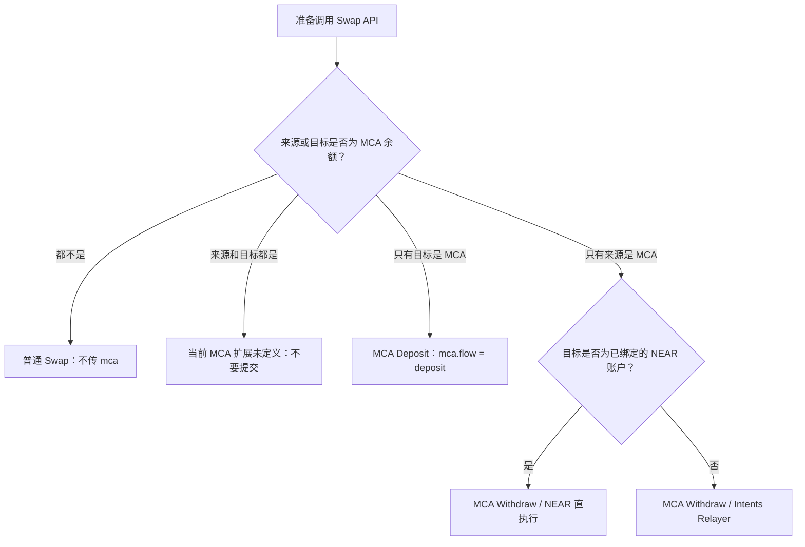
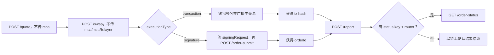
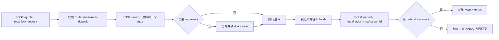
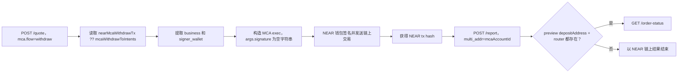
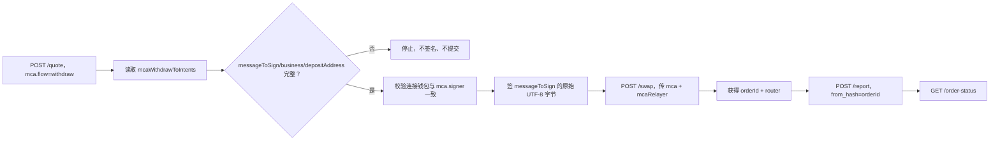
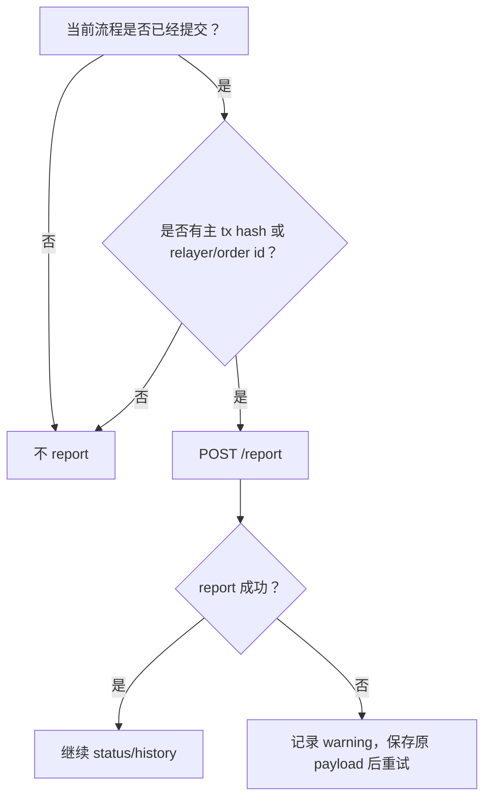

# MCA Swap HTTP API 调用文档

本文描述 MCA 在统一 Swap 服务中的 HTTP 接口、请求字段、响应字段和完整调用顺序。

适用范围：

- 普通链钱包向 MCA deposit。
- MCA withdraw 到绑定 NEAR 钱包。
- MCA withdraw 到其他链，通过 Intents / multichain relayer 提交。
- 交易 report、order status 和 history。

不包含 MCA 创建、钱包绑定、借贷、portfolio 或资产查询接口。

## Base URL 与认证

生产 API 域名固定为：

```text
https://api.rhea.finance
```

所有 Swap API 均使用 `https://api.rhea.finance/api/swap/*`。示例中的 access token 用以下变量表示：

```bash
ACCESS_TOKEN="<your-access-token>"
```

请求头：

```http
Content-Type: application/json
Authorization: Bearer <ACCESS_TOKEN>
```

不要把 access token、钱包私钥、助记词或固定 JWT 写入前端源码。

## 通用响应 Envelope

所有接口返回统一 JSON envelope：

```json
{
  "code": 0,
  "msg": "ok",
  "data": {}
}
```

字段：

| 字段 | 类型 | 说明 |
| --- | --- | --- |
| `code` | number | `0` 表示业务成功；非零表示业务错误 |
| `msg` | string | 错误或提示信息 |
| `data` | object | 接口数据；不同接口结构不同 |

调用方需要同时检查 HTTP status 和 `code`：

```ts
async function swapApi<T>(path: string, init: RequestInit): Promise<T> {
  const response = await fetch(`https://api.rhea.finance${path}`, {
    ...init,
    headers: {
      "Content-Type": "application/json",
      Authorization: `Bearer ${ACCESS_TOKEN}`,
      ...init.headers,
    },
  });

  const body = await response.json();

  if (!response.ok) {
    throw new Error(body.msg || `HTTP ${response.status}`);
  }
  if (body.code !== 0) {
    throw new Error(body.msg || `API code ${body.code}`);
  }

  return body.data as T;
}
```

## 先判断：这次请求是否涉及 MCA

`mca` 不是 `/quote` 或 `/swap` 的通用必填字段。调用方必须先根据资金实际来源和目标判断业务类型，不能看到用户有 MCA 就一律传入 `mca`。

这里的“来源是 MCA”是指本次卖出的余额从 MCA 账户扣除；“目标是 MCA”是指本次买到的资产最终存入 MCA。HTTP API 中 `tokenIn`、`tokenOut` 始终传真实链上 token id，不传 UI 内部的 `mca:xxx` 标识。



等价的程序判断：

```ts
function classifySwap(input: {
  sourceIsMca: boolean;
  targetIsMca: boolean;
  toChain: string;
  recipient?: string;
  boundNearAccountId?: string;
}) {
  if (!input.sourceIsMca && !input.targetIsMca) return "normal";
  if (input.sourceIsMca && input.targetIsMca) return "unsupported";
  if (input.targetIsMca) return "mca-deposit";

  const withdrawsToBoundNear =
    input.toChain === "near" &&
    Boolean(input.recipient) &&
    input.recipient === input.boundNearAccountId;

  return withdrawsToBoundNear
    ? "mca-withdraw-near"
    : "mca-withdraw-relayer";
}
```

### 四种流程的请求差异

| 流程 | `/quote` 的 `mca` | `/swap` | `/swap` 的 `mcaRelayer` | MCA 离线消息签名 | 链上钱包签名 | `/report` | `/order-status` |
| --- | --- | --- | --- | --- | --- | --- | --- |
| 普通 Swap | 不传 | 构建普通交易 | 不传 | 不需要 | 执行 `tx` 时需要；签名订单例外见下文 | 主交易提交成功后 | 仅有 status key 和 router 时 |
| MCA Deposit | 必传，`flow=deposit` | 构建来源链交易，并透传相同 `mca` | 不传 | 不需要 | 来源链钱包签 `approve`/主交易 | 主交易拿到 tx hash 后 | 跨链且有 orderId 时 |
| MCA Withdraw 到绑定 NEAR | 必传，`flow=withdraw` | **不调用** | 不传 | 不需要 | NEAR 钱包签 `exec` 交易 | NEAR tx hash 产生后 | preview 有 deposit address 且有 router 时 |
| MCA Withdraw 到其他链 | 必传，`flow=withdraw` | 提交 relayer request | 必传 | **需要**，签 API 原始 `messageToSign` | 通常不再广播本地链交易 | `/swap` 返回 orderId 后 | 使用 orderId + router |

### 不要混淆三类“签名”

- 普通交易签名：钱包签 `/swap` 返回的链交易，不产生 `mcaRelayer.signature`。
- 普通 Swap 的签名订单：当 `/swap` 返回 `executionType: "signature"` 和 `signingRequest` 时，按该对象签名后调用 `/api/swap/order-submit`；这不是 MCA 签名。
- MCA relayer 签名：只发生在 `mcaWithdrawToIntents` 分支，结果放进 `mcaRelayer.signature`，不调用 `/api/swap/order-submit`。

## HTTP 接口概览

| Method | Path | 用途 |
| --- | --- | --- |
| `POST` | `/api/swap/quote` | 普通或 MCA quote；MCA withdraw 时可能返回执行 preview |
| `POST` | `/api/swap/swap` | 构建普通/deposit 交易，或提交 MCA withdraw relayer |
| `POST` | `/api/swap/report` | tx hash 或 relayer orderId 产生后登记历史 |
| `GET` | `/api/swap/order-status` | 已提交订单的状态查询 |
| `GET` | `/api/swap/history` | 按 sender 查询 Swap 历史 |

`POST /api/swap/order-submit` 只用于 CoW 等普通签名订单，不是 MCA deposit/withdraw 的必需接口。

支持 Token 元数据使用独立接口 `GET /get_multichain_lending_tokens_data`，不在 `/api/swap/*` 路径下，详见下文“支持 Token 查询接口”。

## Chain ID 与 Token ID

### 完整支持链清单

下面是 `multi-chain-lending` Trade 当前产品级支持清单，共 18 个主网。`fromChain` / `toChain` 必须使用“HTTP API chain id”，查询 Token 时则使用“Token 查询 alias”。

| 链 | 类型 | HTTP API chain id | Token 查询 alias | SDK ChainRef |
| --- | --- | --- | --- | --- |
| Ethereum | EVM | `1` | `eth` | `eip155:1` |
| BNB Smart Chain | EVM | `56` | `bsc` | `eip155:56` |
| Arbitrum One | EVM | `42161` | `arb` | `eip155:42161` |
| Base | EVM | `8453` | `base` | `eip155:8453` |
| Optimism | EVM | `10` | `op` | `eip155:10` |
| Berachain | EVM | `1385` | `bera` | `eip155:1385` |
| Monad | EVM | `143` | `monad` | `eip155:143` |
| X Layer | EVM | `196` | `xlayer` | `eip155:196` |
| Polygon PoS | EVM | `137` | `pol` | `eip155:137` |
| Gnosis Chain | EVM | `100` | `gnosis` | `eip155:100` |
| Plasma | EVM | `9745` | `plasma` | `eip155:9745` |
| Solana | 非 EVM | `solana` | `sol` | `solana:mainnet` |
| Bitcoin | 非 EVM | `btc` | `btc` | `bitcoin:mainnet` |
| NEAR | 非 EVM | `near` | `near` | `near:mainnet` |
| Zcash | 非 EVM | `zcash` | `zcash`、兼容 `zec` | `zcash:mainnet` |
| Aptos | 非 EVM | `aptos` | `aptos` | `aptos:mainnet` |
| Tron | 非 EVM | `tron` | `tron` | `tron:mainnet` |
| Sui | 非 EVM | `sui` | `sui` | `sui:mainnet` |

这里的“支持”表示产品会加载该链 Token 并允许其进入统一 quote 流程，不表示任意两个 Token 之间一定存在可执行路线。路由还会受到实时流动性、router/bridge 能力、金额和服务状态影响，必须以 `POST /api/swap/quote` 是否成功返回有效 `bestQuote.router` 为最终判断。

### 支持 Token 查询接口

按链查询 Trade 使用的多链 Token 元数据：

```http
GET https://api.rhea.finance/get_multichain_lending_tokens_data?chains=<COMMA_SEPARATED_ALIASES>
```

该接口不使用 `/api/swap/*` envelope，成功响应直接返回 Token object array。它用于 Token 发现和元数据展示，不用于判断某个交易对当前是否有路线。

Query 参数：

| 参数 | 必填 | 说明 |
| --- | --- | --- |
| `chains` | 是 | 一个或多个 Token 查询 alias，使用英文逗号分隔；alias 必须来自上表 |

查询单条链：

```bash
curl "https://api.rhea.finance/get_multichain_lending_tokens_data?chains=eth"
```

一次查询当前全部产品支持链：

```bash
curl "https://api.rhea.finance/get_multichain_lending_tokens_data?chains=bsc,eth,arb,base,op,bera,monad,xlayer,pol,gnosis,plasma,sol,btc,near,zcash,zec,aptos,tron,sui"
```

响应类型：

```ts
interface SupportedToken {
  assetId: string;
  decimals: number;
  blockchain: string;
  symbol: string;
  price: number;
  priceUpdatedAt: string;
  contractAddress?: string | null;
  icon?: string;
  coinType?: string;
  platform?: string;
}

type SupportedTokenResponse = SupportedToken[];
```

字段说明：

| 字段 | 类型 | 说明 |
| --- | --- | --- |
| `assetId` | string | Intents/多链资产 ID；不能不经转换就当作所有链的 `tokenIn` / `tokenOut` |
| `decimals` | number | Token decimals |
| `blockchain` | string | Token 所属链 alias，应与请求的 `chains` 集合匹配 |
| `symbol` | string | 展示 symbol，不可代替 token address/id |
| `price` | number | 可选展示用途的当前价格值；不能作为 quote 输出 |
| `priceUpdatedAt` | string | 价格更新时间 |
| `contractAddress` | string \| null | 链上 token address；原生资产可能为空 |
| `icon` | string | 可选图标 URL |
| `coinType` | string | Sui 等链可能使用的 coin type |
| `platform` | string | Token 来源平台，例如 Intents/router provider |

接入规则：

- 使用 `blockchain` 将结果归入对应链，不能只按 `symbol` 合并 Token。
- 发起 quote 时，使用该链实际要求的 token address/id；MCA 侧仍按下文规则移除 `mca:`、`nep141:` 或 `nep245:` 前缀。
- Token 出现在查询结果中只代表可被产品发现。真正下单前必须请求 `/api/swap/quote`，并校验有效的 `bestQuote.router`。
- 不要把查询结果长期写死在客户端；可以短时缓存，但应允许刷新。

### 原生资产 Token ID

原生资产常用 token id：

| 链 | 原生资产 token id |
| --- | --- |
| EVM | `0x0000000000000000000000000000000000000000` |
| Solana | `So11111111111111111111111111111111111111112` |
| Aptos | `0xa` |
| NEAR | `wrap.near` |
| Tron | `trx` |
| Bitcoin | `btc` |
| Zcash | `nep141:zec.omft.near` |
| Sui | `0x2::sui::SUI` |

MCA 侧 token 使用 Swap API/Burrow 接受的 token id，例如 `usdc.token.near`，不要传 UI 内部的 `mca:...` 标识。

只要某一侧是 MCA，该侧的 API chain id 固定为 `near`，token id 使用去掉 `mca:`、`nep141:` 或 `nep245:` 前缀后的 NEAR 合约 account id。

`amountIn`、`amountOut`、`minAmountOut`、`expectedOut` 等 Swap 金额使用 token 最小单位整数字符串。`decreaseCollateralAmountBurrow` 是例外：它使用 Burrow portfolio 返回的 decimal balance string，可以包含小数点，不能用 token decimals 再次换算。

MCA 流程的地址含义：

| 流程 | `sender` | `recipient` |
| --- | --- | --- |
| Deposit | 来源链付款钱包 | MCA account id |
| Withdraw 到绑定 NEAR | MCA account id | 已绑定的 NEAR account id |
| Withdraw Relayer | MCA account id | 最终外部链/未绑定 NEAR 接收地址 |

## `mca` 字段什么时候传、怎么传

只有 `classifySwap` 的结果是 `mca-deposit`、`mca-withdraw-near` 或 `mca-withdraw-relayer` 时，`POST /api/swap/quote` 才传 `mca`。

- 普通 Swap：整个 `mca` 字段省略，不能传 `{}` 或 `null`。
- MCA Deposit：quote 和后续 `/swap` 使用同一个 `mca` 对象。
- MCA Withdraw 到绑定 NEAR：只在 quote 中传；后续直接执行 preview，不调用 `/swap`。
- MCA Withdraw 到 relayer：quote 中传；提交 `/swap` 时继续透传，并额外加入 `mcaRelayer`。

Deposit 示例：

```json
{
  "flow": "deposit",
  "mcaAccountId": "account.near",
  "signer": {
    "chain": "evm",
    "identityKey": "0xSignerAddress"
  },
  "useAsCollateral": true
}
```

Withdraw 示例：

```json
{
  "flow": "withdraw",
  "mcaAccountId": "account.near",
  "signer": {
    "chain": "evm",
    "identityKey": "0xSignerAddress"
  },
  "needDecreaseCollateral": true,
  "decreaseCollateralAmountBurrow": "12.5",
  "withdrawAll": false
}
```

字段条件：

| 字段 | 类型 | 必填 | 说明 |
| --- | --- | --- | --- |
| `flow` | `deposit \| withdraw` | MCA 是 | MCA 资金方向；普通 Swap 不存在整个 `mca` 对象 |
| `mcaFlow` | `deposit \| withdraw` | 否 | `flow` 的兼容别名 |
| `mcaAccountId` | string | MCA 是 | MCA NEAR account id |
| `mca_id` | string | 否 | `mcaAccountId` 的兼容别名 |
| `signer.chain` | string | MCA 是 | 本次控制 MCA 的已绑定钱包链类型 |
| `signer.identityKey` | string | MCA 是 | 已绑定钱包 identity；relayer 签名钱包必须与它一致 |
| `depositSigner` | object | 否 | deposit signer 的兼容字段 |
| `useAsCollateral` | boolean | deposit 是 | deposit 后是否作为 collateral，明确传 `true` 或 `false` |
| `needDecreaseCollateral` | boolean | withdraw 是 | 当前 token 的 Burrow collateral balance 大于 0 时为 `true` |
| `decreaseCollateralAmountBurrow` | string | withdraw 是 | `true` 时传当前 token 的完整 collateral balance；`false` 时传 `"0"`。不是 `amountIn` |
| `withdrawAll` | boolean | 否 | Max，或请求数量达到可用余额的 `99.9999%` 时传 `true`；部分提取省略或传 `false` |
| `recipientMsgSignatures` | string[] | 条件字段 | 只透传已有的 recipient proof；不是 `messageToSign` 的签名，默认省略 |
| `depositSignerProofSignatures` | string[] | 条件字段 | 只透传已有的 deposit signer proof；默认省略 |
| `amountBurrow` | string | 否 | 兼容 amount 字段 |
| `amount_with_inner_decimal` | string | 否 | 兼容 amount 字段 |
| `amount_burrow` | string | 否 | 兼容 amount 字段 |

新接入优先使用 `flow`、`mcaAccountId` 和 `signer`。`mcaFlow`、`mca_id`、`depositSigner` 和三种 amount 别名只用于兼容旧调用方，不要同时发送新旧字段。

`recipientMsgSignatures`、`depositSignerProofSignatures` 与 relayer 的 `messageToSign` 是三类不同数据。当前 Swap 流程不会主动生成前两个数组；只有调用方已经从受信任流程拿到对应 proof 时才透传，不能用本次 relayer signature 填充。

Withdraw collateral 决策应在 quote 前完成：

```ts
const needDecreaseCollateral = decimalGt(collateralBalance, "0");
const decreaseCollateralAmountBurrow = needDecreaseCollateral
  ? collateralBalance
  : "0";
const withdrawAll =
  isMax || decimalGte(amountInHuman, decimalMul(availableBalance, "0.999999"));
```

这里的 `amountInHuman` 只用于判断是否接近全额；发送给 Swap API 的 `amountIn` 仍然是最小单位整数。

## Quote 接口参考：POST `/api/swap/quote`

获取 quote、router、build pass-through 字段和 MCA 执行 preview。

### Request

```http
POST /api/swap/quote
Content-Type: application/json
Authorization: Bearer <ACCESS_TOKEN>
```

普通 Swap 基础 body（注意没有 `mca`）：

```json
{
  "fromChain": "1",
  "toChain": "near",
  "tokenIn": "0xA0b86991c6218b36c1d19d4a2e9eb0ce3606eb48",
  "tokenOut": "usdc.token.near",
  "amountIn": "1000000",
  "slippage": 50,
  "sender": "0xSenderAddress",
  "recipient": "account.near"
}
```

基础字段：

| 字段 | 类型 | 必填 | 说明 |
| --- | --- | --- | --- |
| `fromChain` | string | 是 | 来源链 API chain id |
| `toChain` | string | 是 | 目标链 API chain id |
| `tokenIn` | string | 是 | 来源 token id/address |
| `tokenOut` | string | 是 | 目标 token id/address |
| `amountIn` | string | 是 | 最小单位整数字符串 |
| `slippage` | number | 否 | basis points；`50` 表示 0.5% |
| `sender` | string | 是 | 来源钱包或 MCA account |
| `recipient` | string | 否 | 最终接收地址 |
| `mca` | object | 条件必填 | 只有单侧 MCA deposit/withdraw 时传；普通 Swap 必须省略 |

### Response

下面是 MCA Deposit quote 响应示例；普通 Swap 不会要求这些 MCA preview 字段：

```json
{
  "code": 0,
  "msg": "ok",
  "data": {
    "isCrossChain": true,
    "chainType": "cross-chain",
    "bestQuote": {
      "router": "near-mca-deposit",
      "amountOut": "995000",
      "minAmountOut": "990025",
      "market": "example-market",
      "preSwap": null,
      "bridge": null,
      "quoteId": "optional-quote-id"
    },
    "allQuotes": [],
    "nearDepositTx": {},
    "nearDepositTxError": null
  }
}
```

公共 response 字段：

| 字段 | 类型 | 说明 |
| --- | --- | --- |
| `isCrossChain` | boolean | 是否跨链 |
| `chainType` | string | 来源链 transaction 类型或 `cross-chain` |
| `bestQuote` | object | 最优 quote；后续 `/swap` 需要透传其中部分字段 |
| `allQuotes` | object[] | 其他候选 quote |
| `errors` | unknown | 路由聚合错误信息 |
| `nearDepositTx` | object | MCA deposit preview |
| `nearDepositTxError` | string | deposit preview 错误 |
| `nearMcaWithdrawTx` | object | withdraw 到 NEAR 的 MCA `exec` preview |
| `nearMcaWithdrawTxError` | string | withdraw preview 错误 |
| `mcaWithdrawToIntents` | object | withdraw 到 Intents/其他链的 relayer preview |
| `mcaContext` | object | 可选 MCA 上下文 |

业务必须检查：

- `bestQuote.router` 非空。
- `near-mca-deposit` 时 `nearDepositTxError` 为空。
- `near-mca-withdraw` 时 `nearMcaWithdrawTxError` 为空。

## 流程：普通 Swap（不涉及 MCA）

当来源和目标都不是 MCA 余额时，quote 和 build body 都不传 `mca`，report 也不传 `multi_addr`。



quote 使用前面的普通 body。将 `bestQuote` 字段透传到 build，但不要追加空的 `mca`：

```json
{
  "fromChain": "1",
  "toChain": "near",
  "tokenIn": "0xA0b86991c6218b36c1d19d4a2e9eb0ce3606eb48",
  "tokenOut": "usdc.token.near",
  "amountIn": "1000000",
  "slippage": 50,
  "sender": "0xSenderAddress",
  "recipient": "alice.near",
  "router": "nearintents",
  "expectedOut": "995000",
  "minAmountOut": "990025",
  "preSwap": null,
  "bridge": {
    "route": "intents"
  }
}
```

执行规则：

- `executionType` 缺失或为 `transaction`：按 `chainType` 执行 `approve`（如有），再执行主 `tx`。approve hash 不是本次 Swap 的 `from_hash`，不能在 approve 后 report。
- `executionType: "signature"`：签 `signingRequest`，调用 `/api/swap/order-submit`，拿到 orderId 后 report。这与 MCA `messageToSign` 无关。
- 钱包拒签、用户取消、主交易广播失败或 `/order-submit` 失败：没有 tx hash/orderId，不 report。

## 流程：MCA Deposit

目标资产进入 MCA 时，quote 和 build 都传同一个 `mca`。这个分支没有 `messageToSign`，绑定钱包只负责标识 MCA controller；实际签名发生在来源链 `approve`/主交易。



### Deposit Quote Request

```bash
curl -X POST "https://api.rhea.finance/api/swap/quote" \
  -H "Authorization: Bearer $ACCESS_TOKEN" \
  -H "Content-Type: application/json" \
  -d '{
    "fromChain": "1",
    "toChain": "near",
    "tokenIn": "0xA0b86991c6218b36c1d19d4a2e9eb0ce3606eb48",
    "tokenOut": "usdc.token.near",
    "amountIn": "1000000",
    "slippage": 50,
    "sender": "0xSenderAddress",
    "recipient": "account.near",
    "mca": {
      "flow": "deposit",
      "mcaAccountId": "account.near",
      "signer": {
        "chain": "evm",
        "identityKey": "0xSenderAddress"
      },
      "useAsCollateral": true
    }
  }'
```

期望 router：

```text
near-mca-deposit
```

### Deposit Build Request

quote 成功后，构造 build body：

```json
{
  "fromChain": "1",
  "toChain": "near",
  "tokenIn": "0xA0b86991c6218b36c1d19d4a2e9eb0ce3606eb48",
  "tokenOut": "usdc.token.near",
  "amountIn": "1000000",
  "slippage": 50,
  "sender": "0xSenderAddress",
  "recipient": "account.near",
  "mca": {
    "flow": "deposit",
    "mcaAccountId": "account.near",
    "signer": {
      "chain": "evm",
      "identityKey": "0xSenderAddress"
    },
    "useAsCollateral": true
  },
  "router": "near-mca-deposit",
  "market": "example-market",
  "expectedOut": "995000",
  "minAmountOut": "990025",
  "preSwap": null,
  "bridge": null,
  "quoteId": "optional-quote-id"
}
```

字段来源：

| Build 字段 | 来源 |
| --- | --- |
| quote request 公共字段 | 原始 quote request |
| `router` | `bestQuote.router` |
| `market` | `bestQuote.market`，存在时传入 |
| `expectedOut` | `bestQuote.amountOut` 或 `bestQuote.estimatedOut` |
| `minAmountOut` | `bestQuote.minAmountOut`；缺失时使用 `expectedOut` |
| `preSwap` | `near-mca-deposit` / `near-mca-withdraw` 固定传 `null`；普通 router 才透传 `bestQuote.preSwap ?? null` |
| `bridge` | `near-mca-deposit` / `near-mca-withdraw` 固定传 `null`；普通 router 才透传 `bestQuote.bridge ?? null` |
| `quoteId` | `bestQuote.quoteId`，存在时传入 |

请求：

```bash
curl -X POST "https://api.rhea.finance/api/swap/swap" \
  -H "Authorization: Bearer $ACCESS_TOKEN" \
  -H "Content-Type: application/json" \
  -d @deposit-build.json
```

### Deposit Build Response

```json
{
  "code": 0,
  "msg": "ok",
  "data": {
    "isCrossChain": true,
    "chainType": "evm",
    "router": "near-mca-deposit",
    "fromChain": "1",
    "toChain": "near",
    "tokenIn": {
      "address": "0xA0b86991c6218b36c1d19d4a2e9eb0ce3606eb48",
      "symbol": "USDC",
      "decimals": 6
    },
    "tokenOut": {
      "address": "usdc.token.near",
      "symbol": "USDC",
      "decimals": 6
    },
    "amountIn": "1000000",
    "estimatedOut": "995000",
    "minAmountOut": "990025",
    "needsApprove": true,
    "approve": {
      "spender": "0xSpender",
      "tx": {
        "to": "0xToken",
        "data": "0x...",
        "value": "0",
        "gasLimit": "60000",
        "chainId": 1
      }
    },
    "tx": {
      "to": "0xRouter",
      "data": "0x...",
      "value": "0",
      "gasLimit": "250000",
      "chainId": 1
    },
    "deposit": {
      "depositAddress": "optional-deposit-address",
      "orderId": "optional-order-id"
    }
  }
}
```

调用方需要按 `chainType` 执行 `approve` 和 `tx`。不同来源链的 `tx` 格式见下文“Build Response 的链交易格式”。

## 流程：MCA Withdraw 到绑定 NEAR 钱包

只有同时满足以下条件才走 NEAR 直执行：

- 来源余额属于 MCA。
- `toChain` 是 `near`。
- `recipient` 等于该 MCA 已绑定的 NEAR account id。
- quote 的 `nearMcaWithdrawTx ?? mcaWithdrawToIntents` 可作为 NEAR exec preview，且 `nearMcaWithdrawTxError` 为空。

分支由“目标是否为绑定 NEAR account”决定，不以 preview 里的 `submissionMode` 作为分支开关。应用内部使用 `near:mainnet` 等链 ID 时，发给 HTTP API 前仍要归一化为 `near`。



该路径**不调用** `POST /api/swap/swap`，也不签 `messageToSign`。`exec` 参数里的 `signature` 使用空字符串，NEAR 钱包签的是链上 transaction 本身。

### Withdraw-to-NEAR Quote Request

```bash
curl -X POST "https://api.rhea.finance/api/swap/quote" \
  -H "Authorization: Bearer $ACCESS_TOKEN" \
  -H "Content-Type: application/json" \
  -d '{
    "fromChain": "near",
    "toChain": "near",
    "tokenIn": "usdc.token.near",
    "tokenOut": "usdc.token.near",
    "amountIn": "1000000",
    "slippage": 50,
    "sender": "account.near",
    "recipient": "alice.near",
    "mca": {
      "flow": "withdraw",
      "mcaAccountId": "account.near",
      "signer": {
        "chain": "near",
        "identityKey": "alice.near"
      },
      "needDecreaseCollateral": false,
      "decreaseCollateralAmountBurrow": "0",
      "withdrawAll": false
    }
  }'
```

期望 router：

```text
near-mca-withdraw
```

### Withdraw-to-NEAR Preview

NEAR 直执行 preview 的选择优先级：

1. `data.nearMcaWithdrawTx`
2. `data.mcaWithdrawToIntents`，仅在第一项不存在且目标是已绑定 NEAR 时作为 fallback

选中的 preview 可能返回以下任一结构。

结构一：transaction list：

```json
{
  "nearMcaWithdrawTx": {
    "mcaAccountId": "account.near",
    "depositAddress": "status-deposit-address",
    "transactions": [
      {
        "contractId": "account.near",
        "methodName": "exec",
        "args": {
          "business": {
            "action": "withdraw"
          },
          "signer_wallet": {
            "Near": "alice.near"
          }
        },
        "gas": 300,
        "deposit": "0"
      }
    ]
  }
}
```

结构二：NEAR FunctionCall actions：

```json
{
  "nearMcaWithdrawTx": {
    "receiverId": "account.near",
    "actions": [
      {
        "type": "FunctionCall",
        "params": {
          "args": "{\"business\":{\"action\":\"withdraw\"},\"signer_wallet\":{\"Near\":\"alice.near\"}}"
        }
      }
    ]
  }
}
```

调用方必须从选中的 preview 以下位置兼容解析 `business`：

1. `preview.business`
2. `preview.transactions[0].args.business`
3. `preview.actions[].params.args.business`

`actions[].params.args` 可能是 object，也可能是 JSON string。`signer_wallet` 使用相同的优先级和解析规则。解析不到 `business` 时停止执行；解析不到 `signer_wallet` 时才回退为 `{ "Near": recipient }`。

两种结构的执行方式不同：

- 有有效 `transactions[]` 时，逐项映射为 NEAR FunctionCall；保留每项已有 `args`，再用解析出的 `business`、`signer_wallet` 和空 `signature` 覆盖同名字段。
- 只有 `actions[]` 时，`actions` 用来提取业务参数，不直接重放；客户端构造一笔发往 `mcaAccountId` 的 `exec` 调用，使用 300 TGas 和 0 deposit。

### NEAR 合约调用

调用 MCA account 的 `exec`：

```json
{
  "receiverId": "account.near",
  "actions": [
    {
      "type": "FunctionCall",
      "params": {
        "methodName": "exec",
        "args": {
          "business": {
            "action": "withdraw"
          },
          "signer_wallet": {
            "Near": "alice.near"
          },
          "signature": ""
        },
        "gas": "300000000000000",
        "deposit": "0"
      }
    }
  ]
}
```

规则：

- `contractId`/`receiverId` 缺失时使用 `mcaAccountId`。
- `methodName` 缺失时使用 `exec`。
- preview `gas: 300` 表示 300 TGas，应转换为 `300000000000000`。
- preview `deposit` 是 NEAR 单位，应转换为 yoctoNEAR。
- quote 中有 `signer_wallet` 时优先使用；缺失时可以使用 `{ "Near": recipient }`。
- 该路径 `signature` 使用空字符串；NEAR 钱包对链上交易本身签名。
- status deposit address 从选中 preview 的 `depositAddress` / `deposit_address` / `deposit.depositAddress` / `deposit.deposit_address` 解析。直接使用 HTTP API 时，缺失该地址仍可广播链上交易，但无法调用 `/order-status`；SDK 使用 `waitFor: "completed"` 时会在广播前校验该地址并报错，改用 `waitFor: "source-confirmed"` 才只等待 NEAR 链上结果。

## 流程：MCA Withdraw 到 Intents Relayer

来源是 MCA，但目标不是已绑定 NEAR account 时走 relayer。目标可以是 EVM、Solana、Aptos、Sui、BTC 等外部链地址，也可以是未绑定的 NEAR 地址。即使 preview 带有 `submissionMode`，仍以这个地址绑定关系作为最终分支依据。



这个分支的 `/swap` 是 relayer 提交，不是返回一笔让调用方再次广播的来源链 transaction。只有签名成功后才调用 `/swap`；拒签或空签名必须立即停止。

### Relayer Quote Request

```bash
curl -X POST "https://api.rhea.finance/api/swap/quote" \
  -H "Authorization: Bearer $ACCESS_TOKEN" \
  -H "Content-Type: application/json" \
  -d '{
    "fromChain": "near",
    "toChain": "1",
    "tokenIn": "usdc.token.near",
    "tokenOut": "0xA0b86991c6218b36c1d19d4a2e9eb0ce3606eb48",
    "amountIn": "1000000",
    "slippage": 50,
    "sender": "account.near",
    "recipient": "0xRecipientAddress",
    "mca": {
      "flow": "withdraw",
      "mcaAccountId": "account.near",
      "signer": {
        "chain": "evm",
        "identityKey": "0xSignerAddress"
      },
      "needDecreaseCollateral": true,
      "decreaseCollateralAmountBurrow": "12.5",
      "withdrawAll": true
    }
  }'
```

### Relayer Preview Response

```json
{
  "code": 0,
  "msg": "ok",
  "data": {
    "isCrossChain": true,
    "chainType": "cross-chain",
    "bestQuote": {
      "router": "near-mca-withdraw",
      "amountOut": "995000",
      "minAmountOut": "990025",
      "preSwap": null,
      "bridge": null
    },
    "allQuotes": [],
    "mcaWithdrawToIntents": {
      "submissionMode": "multichain_relayer",
      "mcaAccountId": "account.near",
      "messageToSign": "exact message returned by API",
      "business": {
        "action": "withdraw"
      },
      "depositAddress": "intents-deposit-address"
    }
  }
}
```

必须校验：

- `mcaWithdrawToIntents` 是 object。
- `messageToSign` 是非空字符串。
- `business` 是 object。
- 按下面的优先级能解析出非空 deposit address。
- 当前签名钱包与 quote request 的 `mca.signer` 一致。

签名规则：

```ts
const signature = await wallet.signMessage(
  quote.data.mcaWithdrawToIntents.messageToSign
);
```

`messageToSign` 是 opaque string。调用方必须签它的**原始 UTF-8 字节**：

- 不要 `trim()`。
- 不要解析后重新序列化。
- 不要用 `JSON.stringify(business)` 替代。
- 不要自行拼 nonce、deadline、recipient 或其他业务字段。
- 可以使用钱包标准本身规定的 domain/prefix，例如 EVM `signMessage` 的 EIP-191 prefix；不要在调用钱包前手工再加一遍。

`business` 不参与客户端重建。提交 `/swap` 时，将 quote preview 返回的原始 `business` object 原样放入 `mcaRelayer.business`。

deposit address 解析优先级：

1. quote response 顶层 `data.depositAddress`。
2. `mcaWithdrawToIntents.depositAddress` 或 `deposit_address`。
3. `mcaWithdrawToIntents.deposit.depositAddress` 或 `deposit.deposit_address`。
4. `bestQuote` 中相同的 direct/nested 字段。

都不存在时不得签名或提交 relayer `/swap`。参考应用还会读取 quote snapshot/store 中缓存的 deposit address；纯 HTTP 调用方不应依赖 UI store。

### Relayer Wallet Descriptor

`mcaRelayer.wallet` 格式：

| signer chain | `wallet` JSON |
| --- | --- |
| EVM | `{ "EVM": "<address-without-0x>" }` |
| Solana | `{ "Solana": "<public-key>" }` |
| Bitcoin | `{ "Bitcoin": "<signing-public-key>" }` |
| NEAR | `{ "Near": "<account-id>" }` |
| Aptos | `{ "Aptos": "<identity-key>" }` |
| Sui | `{ "Sui": "<identity-key>" }` |
| Zcash | `{ "Zcash": "<signing-public-key>" }` |
| Tron | `{ "Tron": "<identity-key>" }` |

API raw type 允许 `wallet` 是 object 或 compact JSON string；参考调用逻辑发送 object，新接入也应优先发送 object，避免二次 JSON 编码。wallet descriptor 必须与 quote 的 `mca.signer` 表示同一钱包。EVM identity 比较时忽略 `0x` 和大小写；Aptos/Sui identity 比较时忽略大小写；其他链按原字符串比较。

### `mcaRelayer.signature` 的格式

HTTP 字段类型统一为 string，但 string 的内部编码由 `wallet` variant 决定。以下是 `multi-chain-lending` 当前参考实现的编码标准：

| Wallet variant | 签名输入和算法 | `mcaRelayer.signature` 内容 |
| --- | --- | --- |
| `EVM` | `signer.signMessage(messageToSign)`，即 EIP-191 personal message | 65-byte signature 的 hex，**去掉 `0x`** |
| `Solana` | 钱包 `signMessage(UTF8(messageToSign))` | 64-byte signature 的 lowercase hex |
| `Bitcoin` | 钱包标准 `signMessage(messageToSign)` | 将钱包返回的 base64 signature 解码后转为 hex |
| `Near` | NEP-413/Wallet Selector `signMessage`，message 为 UTF-8 bytes，recipient 为签名 account，nonce 必须唯一 | 钱包返回 string 时原样传；返回 bytes 时转为 hex |
| `Aptos` | `signMessage({ message, address:false, application:false, chainId:false, nonce:"0" })` | signature hex，去掉 `0x` |
| `Sui` | `signPersonalMessage({ message: UTF8(messageToSign) })` | 规范化后的 raw signature lowercase hex；参考实现会移除 serialized signature 中的 scheme/public-key 包装 |

EVM 示例：

```ts
const signed = await signer.signMessage(messageToSign);
const signature = signed.replace(/^0x/i, "");
```

Solana 示例：

```ts
const bytes = new TextEncoder().encode(messageToSign);
const signed = await wallet.signMessage(bytes);
const signature = Buffer.from(signed).toString("hex");
```

Bitcoin 示例：

```ts
const signed = await wallet.signMessage(messageToSign);
const signature = Buffer.from(signed.signature, "base64").toString("hex");
```

链支持需要区分两件事：

- `{ "Zcash": ... }` 和 `{ "Tron": ... }` 是有效的 MCA wallet descriptor，可用于表示绑定身份。
- 当前 `multi-chain-lending` Swap relayer 流程主动禁止使用 Zcash/Tron 作为本次离线消息 signer；Tron 也没有对应的 `sign_message` 实现。它们仍可作为 deposit/目标链交易执行器。只有服务端验签能力和钱包 adapter 都明确支持后，HTTP 调用方才能用它们生成 `mcaRelayer.signature`。

无论哪条链，最终 signature 必须是非空 string。钱包拒签、返回空值或编码失败时，不得调用 `/swap`。

### Relayer `/swap` Request

`mcaRelayer` 只出现在这个分支的 `/swap` body，不出现在 quote、NEAR 直执行或 deposit 请求中：

| 字段 | 必填 | 来源 |
| --- | --- | --- |
| `mcaRelayer.mcaAccountId` | 是 | 与 quote `mca.mcaAccountId` 完全一致 |
| `mcaRelayer.wallet` | 是 | 根据实际签名链生成的单 key descriptor，且与 quote `mca.signer` 一致 |
| `mcaRelayer.business` | 是 | quote `mcaWithdrawToIntents.business` 原样透传 |
| `mcaRelayer.signature` | 是 | 对 quote 原始 `messageToSign` 的非空签名 string |
| `deposit_address` | 是 | preview 或 `bestQuote` 返回的 Intents deposit address |
| `is_cross_chain` | 是 | 使用 quote 的 `isCrossChain`；缺失时该分支按 `true` |
| `tx_type` | 是 | 固定 `mca-withdraw-relayer` |
| `multi_addr` | 是 | MCA account id，用于 report/history 关联 |

build body 同时保留 quote 使用的 `mca`，不能只传 `mcaRelayer`。

```json
{
  "fromChain": "near",
  "toChain": "1",
  "tokenIn": "usdc.token.near",
  "tokenOut": "0xA0b86991c6218b36c1d19d4a2e9eb0ce3606eb48",
  "amountIn": "1000000",
  "slippage": 50,
  "sender": "account.near",
  "recipient": "0xRecipientAddress",
  "router": "near-mca-withdraw",
  "expectedOut": "995000",
  "minAmountOut": "990025",
  "preSwap": null,
  "bridge": null,
  "mca": {
    "flow": "withdraw",
    "mcaAccountId": "account.near",
    "signer": {
      "chain": "evm",
      "identityKey": "0xSignerAddress"
    },
    "needDecreaseCollateral": true,
    "decreaseCollateralAmountBurrow": "12.5",
    "withdrawAll": true
  },
  "mcaRelayer": {
    "mcaAccountId": "account.near",
    "wallet": {
      "EVM": "SignerAddress"
    },
    "business": {
      "action": "withdraw"
    },
    "signature": "wallet-signature"
  },
  "deposit_address": "intents-deposit-address",
  "is_cross_chain": true,
  "tx_type": "mca-withdraw-relayer",
  "multi_addr": "account.near"
}
```

curl：

```bash
curl -X POST "https://api.rhea.finance/api/swap/swap" \
  -H "Authorization: Bearer $ACCESS_TOKEN" \
  -H "Content-Type: application/json" \
  -d @mca-withdraw-relayer.json
```

### Relayer Response

```json
{
  "code": 0,
  "msg": "ok",
  "data": {
    "isCrossChain": true,
    "chainType": "near",
    "router": "near-mca-withdraw",
    "statusRouter": "near-mca-withdraw",
    "fromChain": "near",
    "toChain": "1",
    "tokenIn": {
      "address": "usdc.token.near",
      "symbol": "USDC",
      "decimals": 6
    },
    "tokenOut": {
      "address": "0xA0b86991c6218b36c1d19d4a2e9eb0ce3606eb48",
      "symbol": "USDC",
      "decimals": 6
    },
    "amountIn": "1000000",
    "estimatedOut": "995000",
    "minAmountOut": "990025",
    "tx": null,
    "approve": null,
    "orderId": "relayer-order-id",
    "deposit": {
      "depositAddress": "intents-deposit-address",
      "orderId": "relayer-order-id"
    }
  }
}
```

orderId 解析优先级：

1. `data.orderId`
2. `data.deposit.orderId`

router 解析优先级：

1. `data.router`
2. `data.statusRouter`
3. quote 的 `bestQuote.router`

relayer response 不要求调用方广播 `tx`。提交成功后直接 report 并轮询 order status。

## 什么时候调用 Report

`POST /api/swap/report` 的触发条件不是“调用过 `/swap`”，而是**已经产生可追踪的主交易标识**。



### 需要 Report

| 场景 | Report 时机 | `from_hash` | `multi_addr` |
| --- | --- | --- | --- |
| 普通 transaction Swap | 主 `tx` 广播成功并取得 tx hash 后 | 主 tx hash | 不传 |
| 普通 signature order | `/order-submit` 成功并取得 orderId 后 | orderId | 不传 |
| MCA Deposit | 来源链主交易广播成功后 | 来源链主 tx hash | `mcaAccountId` |
| MCA Withdraw 到 NEAR | NEAR `exec` 广播成功后 | NEAR tx hash | `mcaAccountId` |
| MCA Withdraw Relayer | relayer `/swap` 返回 orderId 后 | orderId | `mcaAccountId` |

### 不需要、也不应该 Report

- 只调用了 `/quote`。
- 只调用了普通/deposit `/swap`，但返回交易尚未广播。
- 只完成了 token approve，主 Swap transaction 还没有提交。
- 钱包拒签、用户取消或签名为空。
- 主交易广播失败、`/order-submit` 失败或 relayer `/swap` 失败。
- 只有 preview、`business`、`messageToSign` 或 deposit address，但没有 tx hash/orderId。
- 查询 `/history`、`/order-status` 本身不触发新的 report。

report 是历史登记/追踪动作。report 失败不回滚已经广播的链上交易或已经接受的 relayer order；调用方应保存完全相同的 payload 稍后重试，不能重新广播交易。

## Report 接口参考：POST `/api/swap/report`

### Request 字段

下面是 MCA relayer report 示例；普通 Swap 需要省略 `multi_addr`：

```json
{
  "sender": "account.near",
  "recipient": "0xRecipientAddress",
  "from_hash": "source-tx-hash-or-order-id",
  "from_token": "usdc.token.near",
  "to_token": "0xA0b86991c6218b36c1d19d4a2e9eb0ce3606eb48",
  "deposit_address": "intents-deposit-address",
  "from_chain": "near",
  "to_chain": "1",
  "is_cross_chain": true,
  "amount_in": "1000000",
  "estimated_out": "995000",
  "router": "near-mca-withdraw",
  "tx_type": "mca-withdraw-relayer",
  "multi_addr": "account.near",
  "swapId": "relayer-order-id"
}
```

```bash
curl -X POST "https://api.rhea.finance/api/swap/report" \
  -H "Authorization: Bearer $ACCESS_TOKEN" \
  -H "Content-Type: application/json" \
  -d @swap-report.json
```

字段：

| 字段 | 类型 | 必填 | 说明 |
| --- | --- | --- | --- |
| `sender` | string | 是 | 来源钱包或 MCA account |
| `recipient` | string | 是 | 最终接收地址 |
| `from_hash` | string | 是 | 来源链 tx hash、NEAR tx hash 或 relayer orderId |
| `from_token` | string | 是 | 来源 token id |
| `to_token` | string | 是 | 目标 token id |
| `deposit_address` | string | 是 | deposit/status address；没有时传空字符串 |
| `from_chain` | string | 否 | 来源链 API chain id |
| `to_chain` | string | 否 | 目标链 API chain id |
| `is_cross_chain` | boolean | 否 | 是否跨链 |
| `amount_in` | string | 否 | 输入金额 |
| `estimated_out` | string | 否 | quote 预计输出 |
| `router` | string | 否 | quote/build router |
| `tx_type` | string | 否 | 交易类型 |
| `multi_addr` | string | MCA 条件必填 | MCA deposit/withdraw 传 MCA account id；普通 Swap 整个字段省略 |
| `swapId` / `swap_id` | string | 否 | order id |
| `extra` | object | 否 | 扩展信息 |

不同 flow 的 report：

| Flow | `from_hash` | `tx_type` | `multi_addr` |
| --- | --- | --- | --- |
| 普通 Swap | 主 tx hash 或签名订单 orderId | router/build 对应类型 | 不传 |
| MCA deposit | 来源链 tx hash | `same-chain` 或 `cross-chain` | MCA account id |
| withdraw 到 NEAR | NEAR tx hash | `mca-withdraw-near` | MCA account id |
| withdraw relayer | relayer orderId | `mca-withdraw-relayer` | MCA account id |

### Response

```json
{
  "code": 0,
  "msg": "ok",
  "data": {
    "id": 12345,
    "from_hash": "source-tx-hash-or-order-id"
  }
}
```

## 什么时候查询 Order Status

只有同时具备 `status key` 和 `router` 才调用 `/api/swap/order-status`：

| 流程 | status key | router | 是否轮询 |
| --- | --- | --- | --- |
| 普通同链 transaction，API 未返回 orderId | 无 | build router | 否，以链上 receipt 为准 |
| 普通跨链/签名订单 | `data.orderId ?? data.deposit.orderId` | `data.statusRouter ?? data.router` | 两者存在时 |
| MCA Deposit | `data.orderId ?? data.deposit.orderId` | `data.statusRouter ?? data.router ?? quote.bestQuote.router` | 有 orderId 时 |
| MCA Withdraw 到 NEAR | 选中 preview 的 deposit address | quote `bestQuote.router` | 两者都存在时 |
| MCA Withdraw Relayer | `data.orderId ?? data.deposit.orderId` | 参考应用使用 `data.router ?? data.statusRouter ?? quote.bestQuote.router` | 两者存在时 |

不能用 tx hash 猜测 orderId，也不能在缺少 router 时盲目调用。status 超时只表示暂时无法确认终态，不代表交易失败；应保留 tx hash/orderId 并允许从 history 继续查看。

## Order Status 接口参考：GET `/api/swap/order-status`

### Request

```http
GET /api/swap/order-status?orderId=<ORDER_ID>&router=<ROUTER>&chainId=<OPTIONAL_CHAIN_ID>
Authorization: Bearer <ACCESS_TOKEN>
```

curl：

```bash
curl "https://api.rhea.finance/api/swap/order-status?orderId=relayer-order-id&router=near-mca-withdraw" \
  -H "Authorization: Bearer $ACCESS_TOKEN"
```

Query：

| 参数 | 必填 | 说明 |
| --- | --- | --- |
| `orderId` | 是 | build/relayer 返回的 order id；某些 NEAR MCA 路径使用 status deposit address |
| `router` | 是 | 使用上一表按具体分支解析出的 router，不要统一套用一个优先级 |
| `chainId` | 否 | CoW 等 router 需要的 EVM chain id；MCA 通常不需要 |

### Response

```json
{
  "code": 0,
  "msg": "ok",
  "data": {
    "status": "SUCCESS"
  }
}
```

status 兼容值：

| API 值 | 含义 |
| --- | --- |
| `PENDING`, `CREATED` | 等待处理 |
| `PROCESSING`, `IN_PROGRESS` | 处理中 |
| `SUCCESS`, `COMPLETED`, `FILLED` | 成功 |
| `FAILED` | 失败 |
| `REFUNDED` | 已退款 |
| `EXPIRED` | 已过期 |

建议轮询：

- 间隔：5 秒。
- 总超时：约 250 秒。
- 终态：成功、失败、退款或过期后停止。
- 超时不代表失败，应提示用户查看 history。

## History 接口参考：GET `/api/swap/history`

### Request

```http
GET /api/swap/history?sender=<SENDER>&pageNumber=1&pageSize=20
Authorization: Bearer <ACCESS_TOKEN>
```

curl：

```bash
curl "https://api.rhea.finance/api/swap/history?sender=0xSenderAddress&pageNumber=1&pageSize=20" \
  -H "Authorization: Bearer $ACCESS_TOKEN"
```

Query：

| 参数 | 必填 | 说明 |
| --- | --- | --- |
| `sender` | 是 | 通用搜索值；后端匹配记录的 `sender`、`recipient` 或 `multi_addr`。查询某个 MCA 时直接传 MCA account id |
| `pageNumber` | 否 | 页码 |
| `pageSize` | 否 | 每页数量 |

### Response

```json
{
  "code": 0,
  "msg": "ok",
  "data": {
    "record_list": [
      {
        "id": 12345,
        "sender": "account.near",
        "recipient": "0xRecipientAddress",
        "from_hash": "relayer-order-id",
        "to_hash": null,
        "deposit_address": "intents-deposit-address",
        "from_token": "usdc.token.near",
        "to_token": "0xA0b86991c6218b36c1d19d4a2e9eb0ce3606eb48",
        "from_chain": "near",
        "to_chain": "1",
        "amount_in": "1000000",
        "estimated_out": "995000",
        "actual_out": null,
        "router": "near-mca-withdraw",
        "tx_type": "mca-withdraw-relayer",
        "is_cross_chain": 1,
        "status": "PROCESSING",
        "multi_addr": "account.near",
        "swap_id": "relayer-order-id",
        "status_response": {},
        "created_at": "2026-07-22 12:00:00",
        "updated_at": "2026-07-22 12:00:00"
      }
    ],
    "page_number": 1,
    "page_size": 20,
    "total_page": 1,
    "total_size": 1
  }
}
```

History 只有一个名为 `sender` 的搜索参数，但它不是只匹配数据库的 sender 列。后端查询条件等价于：

```sql
sender = :query OR recipient = :query OR multi_addr = :query
```

因此查询某个 MCA 的完整历史时，直接请求：

```http
GET /api/swap/history?sender=<MCA_ACCOUNT_ID>&pageNumber=1&pageSize=20
```

不要再根据返回记录的 `multi_addr` 与 MCA account id 是否完全相等来本地过滤。后端返回前可能把 MCA 地址展示为 `Cross-chain Account`，精确比较可能错误丢弃 Deposit 或 Withdraw 记录。分页列表和 `total_page` / `total_size` 应直接采用服务端结果。

## Build Response 的链交易格式

`POST /api/swap/swap` 的 `data.tx` 根据来源执行链返回不同结构。`chainType` 可能直接是 `evm`、`solana` 等，也可能是 `cross-chain`；当它是 `cross-chain` 时，必须根据 `fromChain` 决定 `tx` 的实际格式，不能把 `cross-chain` 当成一种钱包交易类型。

EVM 是否执行 approve 以 `data.approve != null` 为准；`needsApprove` 只是辅助标记。approve 成功后还必须继续执行主 `tx`。

### EVM

```json
{
  "chainType": "evm",
  "tx": {
    "to": "0xRouter",
    "data": "0x...",
    "value": "0",
    "gasLimit": "250000",
    "chainId": 1
  },
  "approve": {
    "spender": "0xSpender",
    "tx": {
      "to": "0xToken",
      "data": "0x...",
      "value": "0",
      "gasLimit": "60000",
      "chainId": 1
    }
  }
}
```

### Solana

```json
{
  "chainType": "solana",
  "tx": {
    "transaction": "<base64-transaction>",
    "format": "base64",
    "addressLookupTableAddresses": [],
    "recentBlockhash": "<blockhash>"
  }
}
```

### Aptos

```json
{
  "chainType": "aptos",
  "tx": {
    "function": "0x1::coin::transfer",
    "type_arguments": ["0x1::aptos_coin::AptosCoin"],
    "arguments": ["0xRecipient", "1000"]
  }
}
```

### NEAR

```json
{
  "chainType": "near",
  "tx": {
    "receiverId": "contract.near",
    "actions": [
      {
        "type": "FunctionCall",
        "params": {
          "methodName": "method",
          "args": {},
          "gas": "30000000000000",
          "deposit": "0"
        }
      }
    ]
  }
}
```

`tx` 也可能是 NEAR transaction array。

### Tron

```json
{
  "chainType": "tron",
  "tx": {
    "kind": "tron_transfer",
    "amount": "1000",
    "depositAddress": "T...",
    "tokenAddress": "TRC20-token-address",
    "standard": "trc20"
  }
}
```

### Bitcoin

```json
{
  "chainType": "btc",
  "tx": {
    "kind": "btc_transfer",
    "amount": "1000",
    "depositAddress": "bc1...",
    "feeRate": 3
  }
}
```

Bitcoin `kind` 也可能是 `utxo_transfer`。

### Zcash

```json
{
  "chainType": "zcash",
  "tx": {
    "kind": "zcash_transfer",
    "amount": "1000",
    "depositAddress": "t1...",
    "decimals": 8
  }
}
```

Zcash `kind` 也可能是 `utxo_transfer`。

### Sui

```json
{
  "chainType": "sui",
  "tx": {
    "kind": "sui_transfer",
    "amount": "1000",
    "depositAddress": "0xRecipient",
    "coinType": "0x2::sui::SUI"
  }
}
```

Sui `coinType` 缺失时，当前 SDK 使用 build response 的 `tokenIn.address` 作为 fallback；HTTP 调用方最好要求服务端明确返回 `coinType`。

## 完整 Relayer Fetch/TypeScript 示例

下面示例只使用 HTTP API，不依赖 SDK：

```ts
type ApiEnvelope<T> = {
  code: number;
  msg: string;
  data: T;
};

async function request<T>(path: string, init: RequestInit): Promise<T> {
  const response = await fetch(`https://api.rhea.finance${path}`, {
    ...init,
    headers: {
      "Content-Type": "application/json",
      Authorization: `Bearer ${ACCESS_TOKEN}`,
      ...init.headers,
    },
  });
  const body = (await response.json()) as ApiEnvelope<T>;
  if (!response.ok || body.code !== 0) {
    throw new Error(body.msg || `Swap API error ${response.status}`);
  }
  return body.data;
}

const quoteRequest = {
  fromChain: "near",
  toChain: "1",
  tokenIn: "usdc.token.near",
  tokenOut: "0xA0b86991c6218b36c1d19d4a2e9eb0ce3606eb48",
  amountIn: "1000000",
  slippage: 50,
  sender: "account.near",
  recipient: "0xRecipientAddress",
  mca: {
    flow: "withdraw",
    mcaAccountId: "account.near",
    signer: {
      chain: "evm",
      identityKey: "0xSignerAddress",
    },
    needDecreaseCollateral: false,
    decreaseCollateralAmountBurrow: "0",
    withdrawAll: false,
  },
};

const quote = await request<any>("/api/swap/quote", {
  method: "POST",
  body: JSON.stringify(quoteRequest),
});

const bestQuote = quote.bestQuote;
const preview = quote.mcaWithdrawToIntents;

if (
  !bestQuote?.router ||
  !preview?.messageToSign ||
  typeof preview.messageToSign !== "string" ||
  !preview.business ||
  typeof preview.business !== "object"
) {
  throw new Error("Invalid MCA relayer preview");
}

const signed = await connectedBoundWallet.signMessage(preview.messageToSign);
const signature = signed.replace(/^0x/i, "");

const depositAddress =
  quote.depositAddress ||
  preview.depositAddress ||
  preview.deposit_address ||
  preview.deposit?.depositAddress ||
  preview.deposit?.deposit_address ||
  bestQuote.depositAddress ||
  bestQuote.deposit_address ||
  bestQuote.deposit?.depositAddress ||
  bestQuote.deposit?.deposit_address;

if (!depositAddress) {
  throw new Error("Missing Intents deposit address");
}

const buildRequest = {
  ...quoteRequest,
  router: bestQuote.router,
  ...(bestQuote.market ? { market: bestQuote.market } : {}),
  expectedOut: bestQuote.amountOut || bestQuote.estimatedOut,
  minAmountOut:
    bestQuote.minAmountOut || bestQuote.amountOut || bestQuote.estimatedOut,
  // near-mca-deposit / near-mca-withdraw 与参考调用逻辑一致，固定为 null。
  preSwap: null,
  bridge: null,
  ...(bestQuote.quoteId ? { quoteId: bestQuote.quoteId } : {}),

  mcaRelayer: {
    mcaAccountId: quoteRequest.mca.mcaAccountId,
    wallet: {
      EVM: quoteRequest.mca.signer.identityKey.replace(/^0x/i, ""),
    },
    business: preview.business,
    signature,
  },
  deposit_address: depositAddress,
  is_cross_chain: quote.isCrossChain ?? true,
  tx_type: "mca-withdraw-relayer",
  multi_addr: quoteRequest.mca.mcaAccountId,
};

const build = await request<any>("/api/swap/swap", {
  method: "POST",
  body: JSON.stringify(buildRequest),
});

const orderId = build.orderId || build.deposit?.orderId;
const router = build.router || build.statusRouter || bestQuote.router;

if (!orderId || !router) {
  throw new Error("Relayer response missing orderId or router");
}

await request("/api/swap/report", {
  method: "POST",
  body: JSON.stringify({
    sender: quoteRequest.sender,
    recipient: quoteRequest.recipient,
    from_hash: orderId,
    from_token: quoteRequest.tokenIn,
    to_token: quoteRequest.tokenOut,
    deposit_address: build.deposit?.depositAddress || depositAddress,
    from_chain: quoteRequest.fromChain,
    to_chain: quoteRequest.toChain,
    amount_in: quoteRequest.amountIn,
    estimated_out: bestQuote.amountOut || bestQuote.estimatedOut,
    router,
    is_cross_chain: true,
    tx_type: "mca-withdraw-relayer",
    multi_addr: quoteRequest.mca.mcaAccountId,
    swapId: orderId,
  }),
});

const query = new URLSearchParams({ orderId, router });
const status = await request<any>(`/api/swap/order-status?${query}`, {
  method: "GET",
});

console.log(status);
```

## 错误与重试建议

| 场景 | 建议 |
| --- | --- |
| HTTP `401` / `403` | 刷新或更换 access token，不自动无限重试 |
| HTTP `429` | 按服务端限流策略退避重试 |
| HTTP `5xx` | quote/status/history 可有限重试；`/swap` 不应盲目重试 |
| `code !== 0` | 展示 `msg`；通常不自动重试业务错误 |
| quote 过期 | 重新调用 `/quote`，不要继续签名或提交 |
| wallet 拒签 | 停止流程，不调用 `/swap` |
| report 失败 | 保留 tx hash/orderId，稍后重试 report |
| order status 超时 | 不视为失败，允许用户从 history 继续查询 |

推荐：

- `/quote`、`/order-status`、`/history` 可以对网络错误、429 和 5xx 做有限指数退避。
- `/swap`、`/report` 不自动重试；提交结果不明确时，先使用已有 orderId、tx hash 或 history 查询，不要盲目重复提交。
- 钱包签名、链上广播不自动重试。
- 保存 quote request、router、orderId、deposit address 和 tx hash，但不要记录 access token、完整签名消息或私钥材料。
